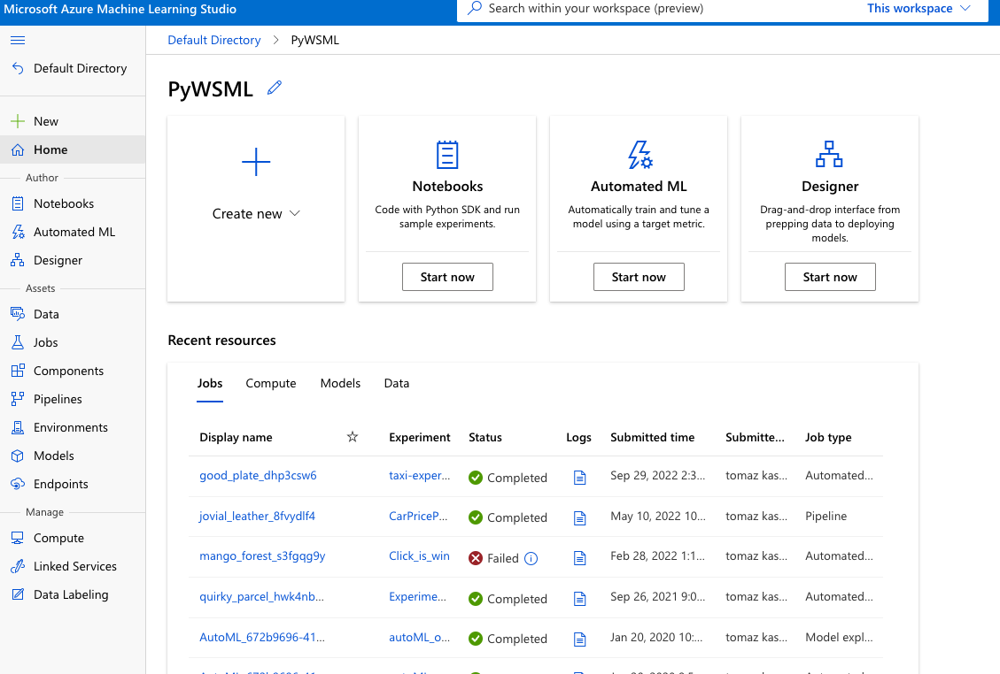

# What is Azure Machine Learning?

Azure Machine Learning (or Azure Machine Learning Service and abbreviation AML) is Azure’s cloud service for creating, managing and productionalising machine learning projects. It is a collaborative tool for Data Scientists, Machine Learning Engineers, and data engineers, covering their daily and operational tasks. From creating and training to deploying and managing predictive models and machine learning solutions.

 

With the support of many open-source platforms and frameworks, implementation becomes fast and repeatable. Just to name a few, MLOps helps monitor, retraining, deploying models and artefacts.

Open source Python frameworks are available of the box and these are:

* PyTorch
* TensorFlow
* scikit-learn
* XGBoost
* LightGBM

## Who is Azure Machine Learning for?

Notebooks will be a great point, where the complete **data science team** will get involved with AML. On top of that, **data analysts** will also be part of the project. **Machine Learning engineers** will do the DevOps and MLOps part and **data engineers** will also contribute with governance, security and providing enterprise compliance.

**Enterprises** working in the Microsoft Azure cloud will be able to use security and role-based access control (RBAC) for infrastructure.

## What tools do you have available?

Besides the Azure Machine learning Studio,

Snippet of Azure Machine Learning studio

you will also have several additional tools for creating, running and deploying solutions. Most essential is [Python SDK](https://learn.microsoft.com/en-us/python/api/overview/azure/ml/?view=azure-ml-py), general [Azure CLI](https://learn.microsoft.com/en-us/cli/azure/) with ML extensions, and durable [Azure Resource Manager APIs](https://learn.microsoft.com/en-us/rest/api/azureml/) for ML tooling.

## What can you do with Azure Machine Learning?

Notebooks provide great collaboration within the team of data scientists as well as with other data-orientated teams. Besides that, AML will offer the:

* Train and develop predictive models,
* Develop models for fairness and explainability
* Run, inspect and analyse models
* Deploy ML models and manage the models efficiently with MLOps
* Use AML with your preferred IDE (Visual Code, Jupyter notebooks or any other tool)
* Use Machine Learning Studio (drag&drop objects and connect the dots)
* Use Python or R as your preferred language (note that Python is better supported!)
* Run machine learning workloads anywhere with built-in governance and security
* Connect and integrate with other Azure services to support a machine learning project from end-to-end. These services – just to name the few – are Azure Synapse Analytics, Azure Blob storage, Azure SQL Database, Azure Arc (and run using K8s), Azure App service, and others.
* Get a fast orientation for algorithm selection using AutoML (automated ML) with automated featurization and hyperparameter selection
* Create Real-time inference and batch scoring inference with easy connection to REST
* Monitor and audit your ML projects

## How to get started?

All you need is an Azure subscription (you can get one for [free](https://azure.microsoft.com/en-gb/free/)). Once you register and login, one last thing is a dataset and a problem you wish to solve.