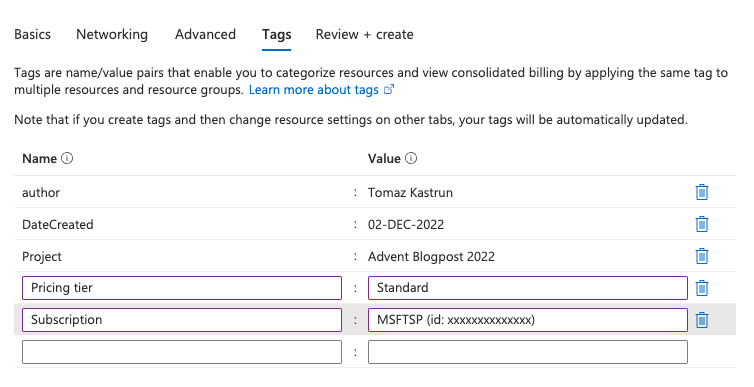

# Creating Azure Machine Learning Workspace

Assuming you already have the Azure subscription and you are logged into Azure portal, search for the "Azure Machine learning" service and click on it. You will get to the entry page and, simply click on "Create.

Fig 1: Creating new workspace

You will select "New workspace". For now, we will work on a workspace. But just to mention, the "New registry" will enable you to share assets among different workspaces, support multi-region replication and help you provision all resources to facilitate region replications.

Once you select "New workspace", you will start creating a new workspace. Make sure to select active Subscription and create or select a meaningful resource group.

Fig 2: Providing resource and workspace details

Workspace details will consist of:
* Workspace Name - This will the name of your workspace
* Region  -  Select the region where all the resources will be provisioned and executed
* Storage account  - Account will be used for storing datastore (unless connecting using URI or database)
* Key vault   - will keep all the security and access
* Application Insight - will keep all the insights of your workspace
* Container registry - will be used for storing and accessing any assets, endpoints or dockers/K8s

Click "Next: Networking" when you define all workspace details.  Under network, I will set it to "Enable public access from all networks" but you can do the opposite, based on your policies. You can always do the opposite and close all public access and open it later. It is not baked into the workspace. You will also want to later check the Networking settings of your workspace when setting up the "private endpoint connections" (in this case you will also have to provide the instance details, virtual network, DNS, and inference details).

Click "Next: Advanced". Advanced settings will  

Fig 3: Advance settings

How you want to set the following parameters will mostly depend on your working environment and how you want to access data. If it is for personal use, you can leave the defaults on, if you are working within the organisation, it is imperative to set the advanced parameters correctly. 

Let's understand them:

Managed identity - if you are working within an organisation, the "user-assigned identity" will be the type you want to select, otherwise, you can select the system-assigned identity. 

Storage account access - Datastores with underlying storage access normally use credential-based access. Connection information (like token authorization, subscription ID, and tenant ID) is stored in the key vault that is associated with the workspace (and was defined in a previous step). When you select identity-based access for the storage account, the user's azure account (ADF directory token) is used to confirm permission for access to the storage. Datastore saves only storage account information, but no authentication credentials.  Again, it depends on the environment you are setting the workspace.  But please note, that identity-based access is not supported when using storage account data for Automated ML experiments!

Data Encryption - if you are using your own encryption key to protect the data in your storage account, select "Customer-managed keys". When using your own encryption keys you can store them in the key vault or managed HSM, or you can use Azure key vault APIs to generate keys-

Data impact - if your environment contains sensitive data, you can select "high business impact workspace" to reduce (monitor) the amount of data collected for diagnostics.

The last part is adding the tags. Make a habit and use the Tags! It is a key: value data where you define any name and give it any value. Tags must coincide with your organisation's policy and billing department so that you will have a detailed overview. Feel free and use meaningful tags that correspond to the organisation's naming convention.

Fig 4: Adding tags for sanity :-)

Click Validate/Create. Once the validation of all the parameters for resources is passed, you can create the workspace. 

Check the deployment process, and learn the type of resources used (These same resources are available as ARM templates or can be used as BICEP low-code).

Fig 5: Deployment in progress

Once the deployment is finished, you can start the Azure Machine Learning Studio. And this will be the topic for tomorrow's post, where we will explore AML Studio and try to understand the assets.