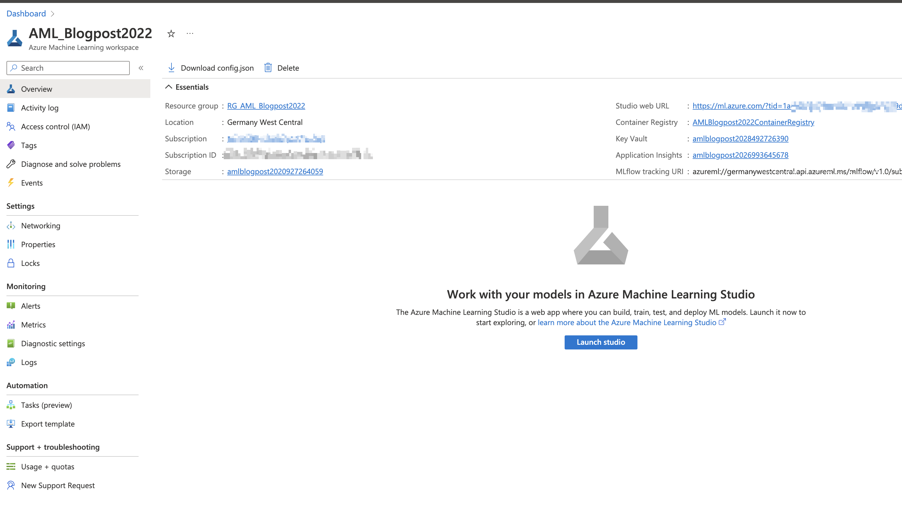
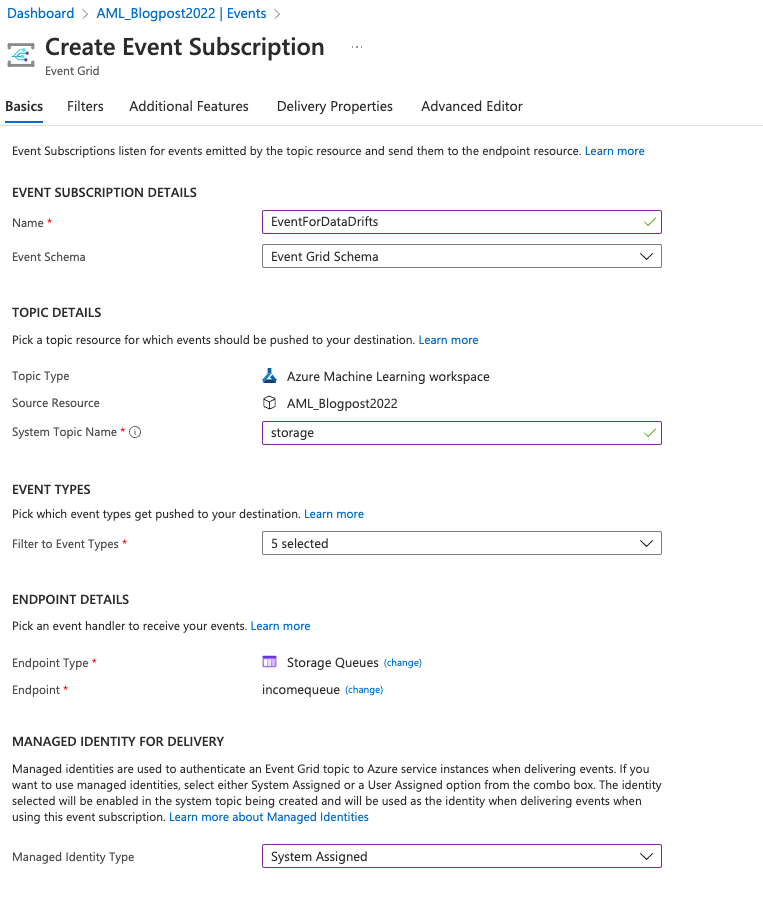
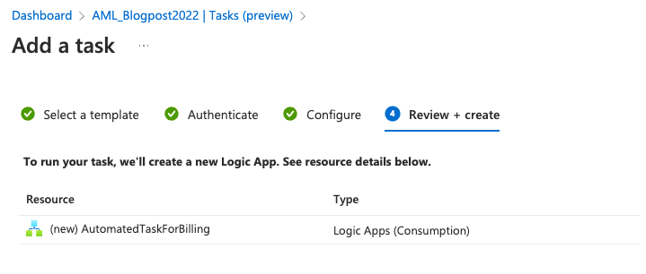
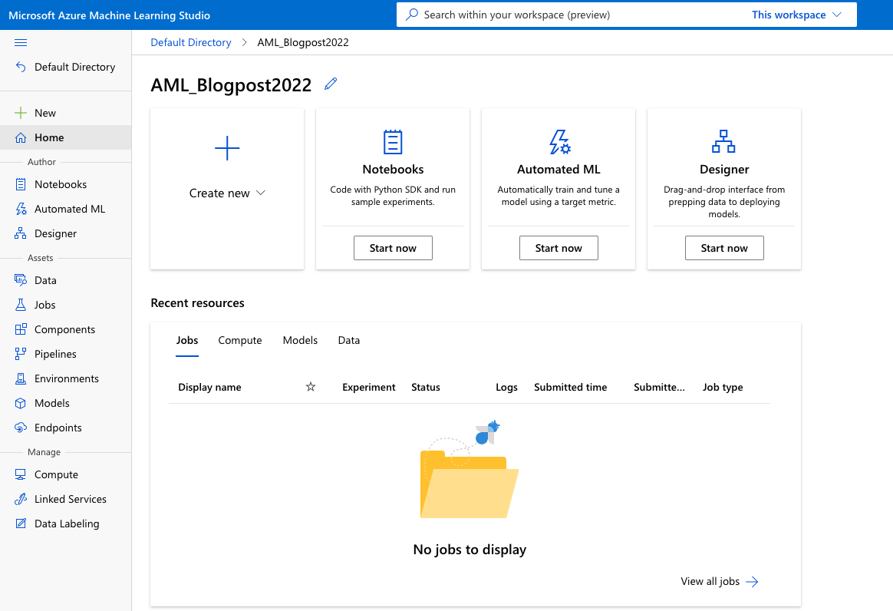
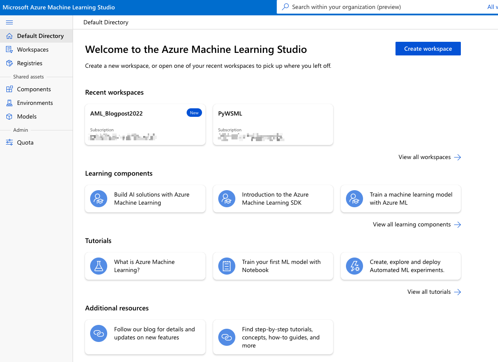
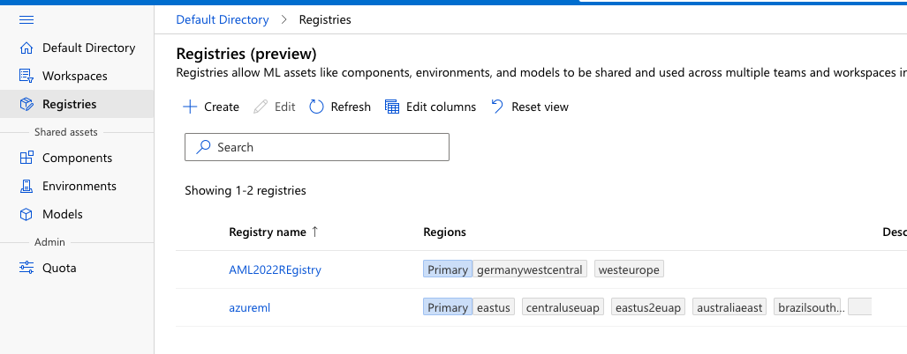
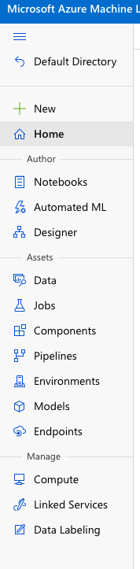

# Understanding Azure Machine Learning Studio

After creating the Azure Machine Learning workspace, you will be able not only to start the Studio but access all the necessary settings and information.

Fig 1: Outlook of Azure Machine Learning workspace

In this overview page, you can click the button “Launch studio” in the middle of the workspace or you can copy and paste the Studio web URL provided under the “Essentials” to start the Studio.

But before we launch the Studio, let’s explore some additional settings, worth mentioning.

**Access control (IAM)** – Here you will be able to view and check security access and access to the resources. You can also check the level of access a user, group, service principal, or managed identity has to this resource (this applies if you have the role of service administrator).

**Events** – will help you attach azure functions, webhooks, storage queues and many others when the event happens. This will be a great way to attach additional actions to events like model registration, model deployment, dataset drift detected and others.

Fig 2: Example of event for data drift for Storage queue

**Networking** – When you need to allow access to this resource through the internet. using a Private endpoint connection or public access.

**Properties** – is a list of all the resources with their IDs. This will become super useful when setting up the connection to other Azure services or other clients. Here you will find “Resource ID”, “Storage account ID”, “Key Vault ID”, “Container Registry ID” and others.

**Tasks (preview)** – is part of the automation process where tasks can be created and scheduled with automated actions – e.g.: scheduling an email for a monthly billing overview. This will create a logic app and you can also create your own logic apps and used them in tasks.

Fig 3: Advance settings

## Default directory

Going back to the “Overview”, now click on the “Launch studio” and you will be redirected to the standalone site. You will get the start page of the studio – mine is called “AML_Blogpost2022” after the workspace we created on day 2.

Fig 4: The start page of Azure Machine Learning studio.

On the left top corner you will find the arrow with “Default Directory”. If you click on this, you will get the general overview (default directory) of Azure Machine Learning bound to your subscription (!).

Fig 5: Default directory of Azure Machine Learning for given subscription

In the **default directory**, you will be able to create new **workspaces** and open existing workspaces. You will also access the Registries, which will allow ML assets like components, environments, and models to be shared and used across multiple teams and workspaces in your organisation. When creating a new workspace for the first time, azureml will be generated automatically.

Fig 6: Registries

Azureml brings different components and environments across different regions as part of the shared assets. Under components, you can find different definitions for Designer (low-code machine learning solution builder) and also different preset environments and frameworks (like PyTorch, TensorFlow, sklearn, responsibleAI and others).

Now that you have an understanding of the default directory and registries, let’s go back to Studio. 🙂

## Azure Machine Learning Studio

In Studio you will always have the navigation available (regardless if shown or hidden).

Fig 7: Navigation

Navigation bar offers you three sections, Author, Assets and Manage. Each section offers different resources and each can be managed also by different users.

Under **Author** section, you will find:

- Notebooks – Create Python notebooks (ipynb), run Python (*.py), run R (*.R) scripts, bash (*.sh) scripts, and others. Notebooks interface is similar to the JupyterLab with access to all working files, folders, terminal and execution components. If you are running R, Python, Bash, YAML scripts, these will be executed in terminal.
- Automated ML – is a complete no-code offering for “black-box” automated model training with creating automated ML jobs. You can select a classification or regression problem, time-series problem, natural language processing, or computer-vision (multi-class or multi-label image classification, object detection or instance segmentation) problem.
- Designer – is a low-code environment with drag-and-drop pre-created components for easy creation of end-to-end machine learning solutions. Both R and Python are supported.

Under **Assets** section:

- Data – is an essential asset. You can access the data using data assets, datastore, and datasets. Data assets represent a reference to the data source location with a copy of its metadata. These references can be Azure ML datastores, Azure Storage (wasbs, abfss, adl, https), local files, public URLs (public https). Datastore is a secure connection to a storage service on Azure by storing connection information, so that you no longer need credential information in your scripts to access your data. Datastore provide connection to Azure Blob, Azure Data Lake Gen2, Azure Files, Azure Data Lake Gen1.
- Jobs – is a list of all experiment runs and all the scheduled jobs.
- Components – are the basic building blocks to perform a specific machine learning task, like model training, and model scoring with predefined input/output ports, parameters and environment that can be reused in different pipelines.
- Pipelines – Create pipeline jobs and pipeline endpoints for
- Environments – is a list of curated environments with installed frameworks (PyTorch, tensorflow, AzureML,…) and are backed by cached Docker images for better performance and low costs.
- Models – is a list of registered prediction models. Here you can also register (import) model from local file, job output or datastore.
- Endpoints – list of real-time and batch endpoints, that allow you to deploy machine learning models as a web service and perform batch inferencing on large volumes of data.

And under **Manage** section:

- Compute – create compute instances (with installed applications of JupyterLab, Jupyter, RStudio, VS Code and Terminal). Here you can also create compute cluster, and inference cluster (you create a Azure Kubernetes Service (AKS) cluster and attach your workspace, then deploy your model as a REST endpoint) and use the attached compute.
- Linked Services – integrate azure machine learning with other Azure services (Azure Synapse) and manage linked assets. You can also attach Spark pools and use Spark notebooks.
- Data Labeling – create a labelling project for image classification (Multi-class or multi-label), object identification (Bounding Box), or Instance segmentation (Polygon). Images for data labeling project must available in an Azure blob datastore. 