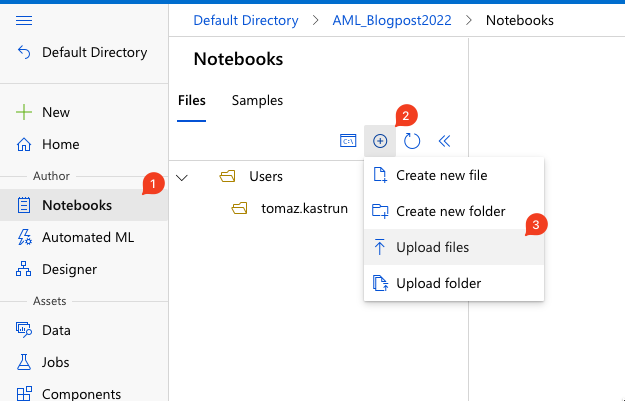

# Understanding Azure Machine Learning Studio

## Data Assets

Click on “Data” under Assets and click on **“+ CREATE”** button.

A new dialogue window will appear to create data assets. In this case, I am selecting Type: “File (uri_file)”

Fig 1: Creating data asset

Confirming the type will get you to the next step, where you will define the data source.

Fig 2: Selecting the source of your data asset

From this point, onward, you can get the data from a local file, from a URI or from Azure storage.

## Getting data from local file

Selecting “From Local files” will get you to the next step. Selecting already created Azure Blob Storage will use the storage that was created when we created the workspace (on day 1).

Fig.3.: Using blob storage

In the next step, you will upload the file. The file is available in the GitHub repository;  https://github.com/tomaztk/Azure-Machine-Learning (folder Data -> iris.csv).

Fig.4.: Uploading data file from a local machine to Azure Blob Storage

You will get the confirmation, and review page and click “Create”. This will upload the file and create a data asset with the data source of workspaceblobstore.

## Getting data from Azure Blob Storage folder

Let’s check the Storage explorer. Navigate to the Storage account (that we created on day 2) and click Storage browser.

Fig.5.: Storage account for Azure Machine Learning

Now you can access the blob container and create a folder structure for your needs.

Fig.6.: Blob containers for AML Storage account

Within the “Azureml-blobstore-{guid}” I will create a new folder ML_iris and upload two files – iris.csv and another copy of iris-_duplicate.csv file. This will enable multiple CSV files reads in Azure Machine Learning

Fig.7.: Creating folder and uploading files

Now we can go back to Studio and add data assets, but this time choose “From Azure Storage”.

Fig.2.:Selecting the source of your data asset

Then select Azure blob storage with the name “workspaceblobstore”. And finally, select the complete folder / Storage path. All data in this path will be used as data assets.

Fig.8.: Selecting storage path

Review the complete path and hit create.

Under data assets you will see, that we have created two datastores from the blob store, one being just a single file, and the other being a folder.

Fig.9.: File or folder as data source for blob store

## Getting data from Azure SQL database

Assuming, you have created an Azure SQL Database, you can also add it as a source for your machine learning data source.

Navigate to Datastores and click “+ Create”, to create a datastore. Under the Datastore type, you will select “Azure SQL Database”.

Fig.10.: Adding datastore from Azure SQL Database

Filling in all the relevant information, the datastore will be created with the correct values.

## Uploading data to files in Notebook

Another way – especially when exploring or doing some minor analysis – to get the data to Azure Machine Learning is to click “Notebook” from the navigation bar and simply upload the data.

Fig.11.: Uploading files directly to Notebook

And after the file is uploaded, the preview of data is created:

Fig.12.: Preview of the data

When you upload the file, that is visible in the notebook, you are uploading it to the Azure file share. You can check the file share within the Storage account browser to see, the files and folders, that are directly visible in Notebooks. Under the “File Shares”, you will find the “code-{guid}” folder with “Users/tomaz.kastrun” folder structure that corresponds to Notebook directory structure.

Fig.13.: File share in Storage browser

Another way to get to these files is to go to Data assets and under Datastores, there will be “workspaceworkingdirectory” Azure file share (created automatically). Exploring and viewing the data will also reveal the same folder structure and all the files that are used or created in the Azure file share with notebooks.

Fig.14.: Azure file share in Datastores

Now that we have imported, uploaded or stored the data to our machine learning workspace, we need another ingredient, compute power. Tomorrow, we will look into provisioning and managing compute assets.