# Creating compute and cluster instances in Azure Machine Learning

With a basic understanding of data assets, let’s create compute instances. Under “Manage” in the navigation bar, select “Compute” (denoted as 1), select “Compute instances” (d. 2) and click on “+ New”.

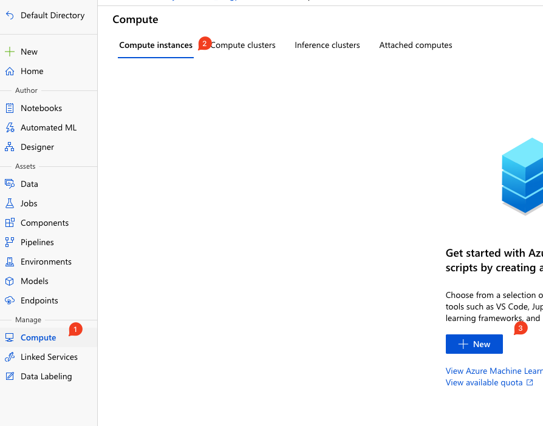
Fig. 1: Creating new compute instance

Each compute instance is a **managed cloud-based workstation for data scientists**. Each compute instance can have only one owner, but you can share files, notebooks, and artefacts between multiple compute instances within the same workspace.

Each instance comes preinstalled with Jupyter, Jupyter Hub, VS Code (still in preview as of writing this blog post), R Studio and terminal. You can also save time and select pre-configured instances with ML packages, deep learning frameworks and CUDA, CuDNN GPU drivers.

Instances are fully customizable and for auto-provisioning, there are functions available within Azure Machine Learning SDK (Python, Azure CLI, Powershell*). Essentially, a single compute instance enables you to analyse, train, and deploy models in a fully integrated notebook experience in your workspace. You can even run Jupyter notebooks in VS Code or connect to AML Compute instance with Python SDK with no SSH needed (which you can also enable). You can also install additional R or Python packages for machine learning or switch between different kernels.

## Compute Instance

There are predefined or recommended options for a quick start, but you can go from the get-go all in with customisation.

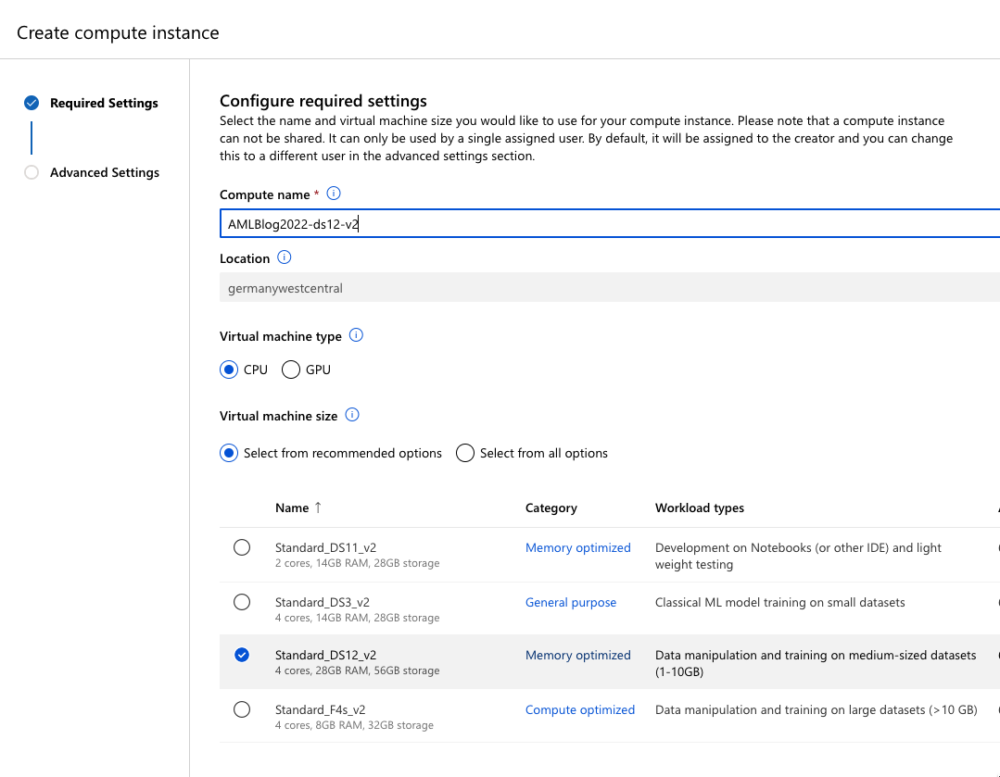
Fig.2: Configuring compute instance

After selecting a relative default settings (as seen on figure 2), you will get to advanced settings.

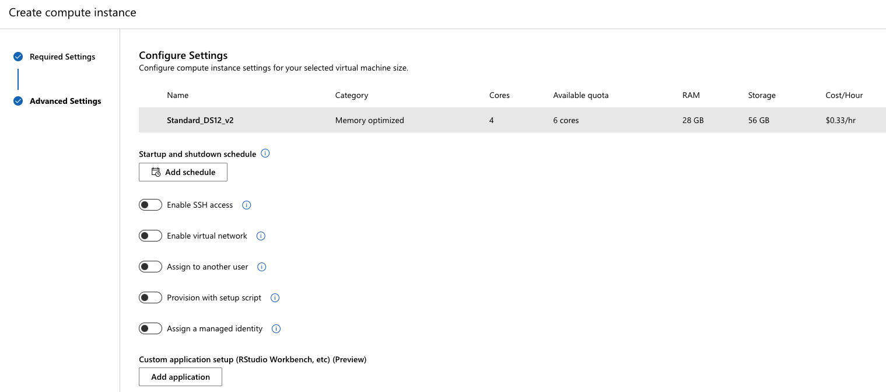
Fig.3: Advanced settings to tailor your needs.

You can enable SSH access, assign compute instance to a different user, provision this instance with a setup script (it can be a notebook or a script with additional command line settings and time-out. language can be Python or Azure CLI), schedule a start or shutdown and even add a custom application, that must be prepared as docker image.

We hit Create and the compute instance will be provisioned.

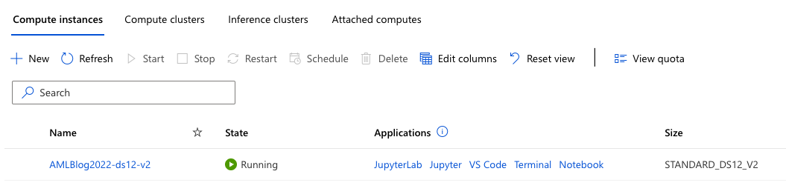
Fig. 4: Provisioned instance with name, status and applications

You can immediately jump to any of the applications – JupyterLab, Jupyter, VS Code, Termina, Notebook or RStudio (which has been recently removed but can be added as a docker image at: _ghcr.io/azure/rocker-rstudio-ml-verse:latest;_ follow the link for detailed instructions.) which was embedded in the browser. If you click on JupyterLab or Jupyter, you will be redirected to the instance URL with many possible kernels (Python, R, Markdown and terminal).

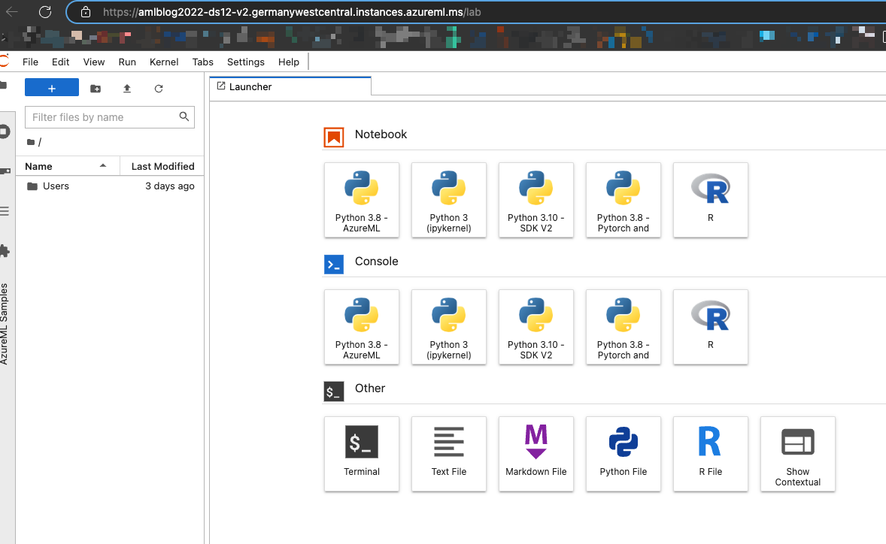
Fig. 5: Outlook of JupyterLab on compute instance

You can run different versions of Python (3.8 – AzureML, 3.8 – Pytorch, 3.10 – SDK V2 to name a few) and single version of R. In later posts we will be using Python SDK V2, Pytorch and AzureML. 🙂

## Compute cluster

Compute cluster or compute target (this includes different types of clusters – compute, inference or attached) is a single or multi-node compute cluster where you can easily scale up to do distributed training and work on much larger datasets. As you scale up your dataset, you can use a single- or multi-node cluster that auto-scales for you, each time you submit a job.

Go to Compute and click on Compute cluster. And you can select the virtual machine tier with the dedicated machine(s) – this depends on how many you have created in the workspace (or in the registry) or low priority, which are significantly cheaper but do not guarantee available computer nodes.

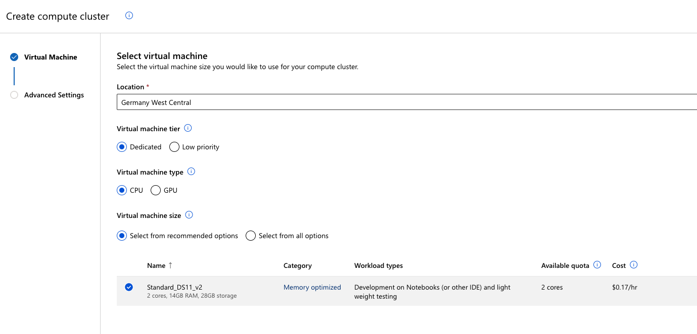
Fig.6: Creating compute cluster

In the next step, you can define the number (min and max) of nodes available in this compute cluster and the idle time (when a node is inactive, it will be scaled down to a minimum number of nodes after the seconds given).

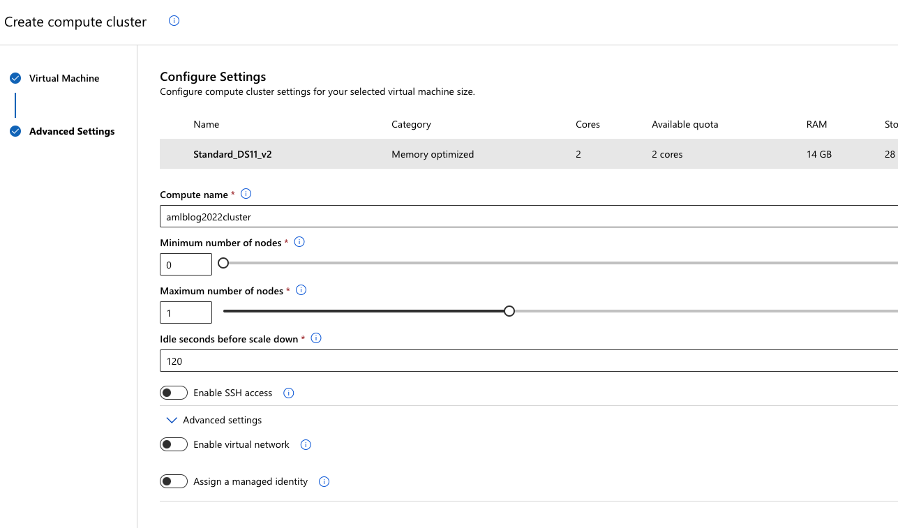
Fig. 7: Setting the nodes and time for scale down

When created, you can always check the running nodes in your cluster.

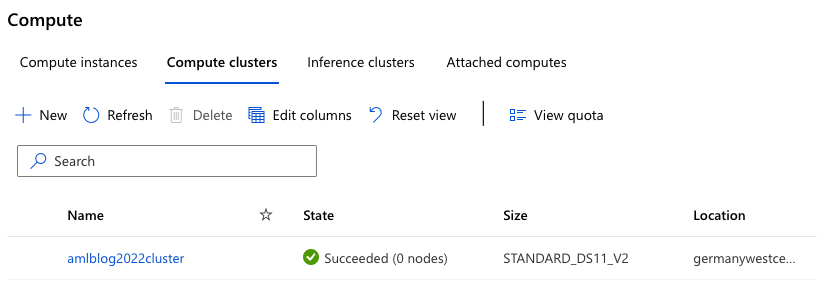
Fig.8: Overview of cluster

## Inference cluster

When deploying your model for consumption as REST API, you will go and create an inference cluster (or target cluster for inference).

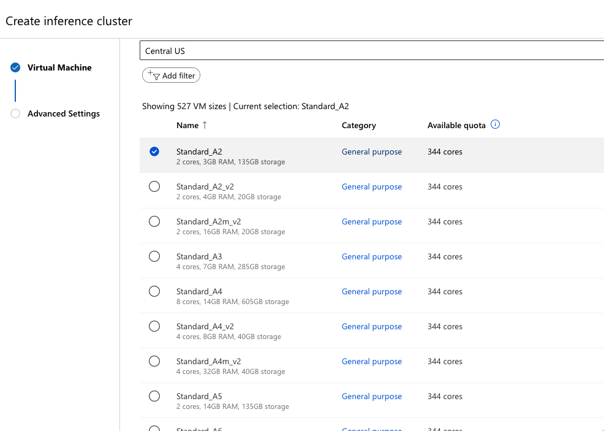
Fig.9: Creating inference cluster

And specify the name and SSL settings, network settings and type of usage (production or dev-test).

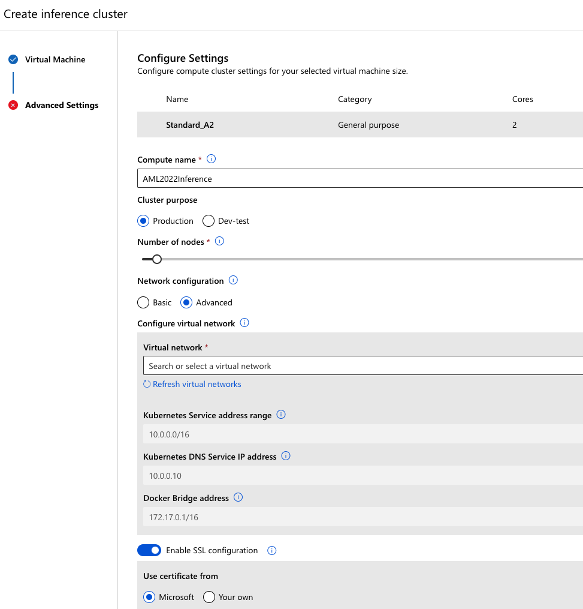
Fig.10: Settings for inference cluster

By default, you will get AKS (Azure Kubernetes service) deployed and ready for consumption. Please note that VM compute must be more than 2 cores and 4GB memory is required, otherwise AKS cluster will not be created.

And at last, you will get your inference cluster ready.

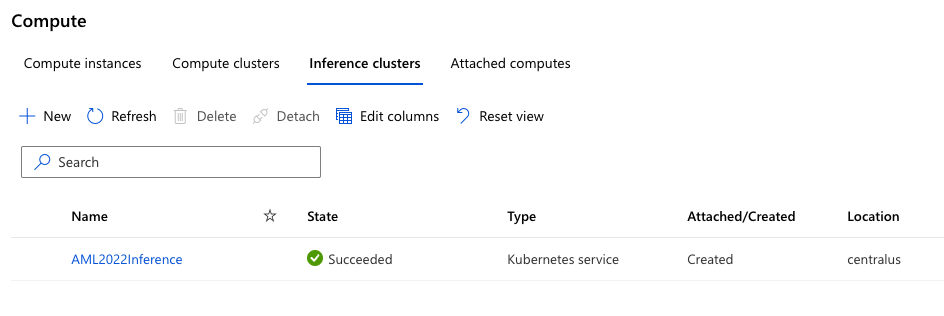
Fig.11: AKS for inference clusters

Following, we will look into the basics of environments and what they are and what they are useful. 