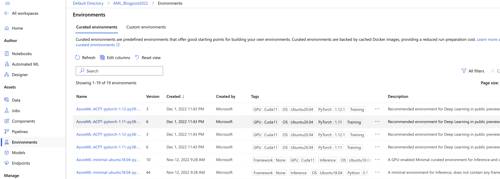
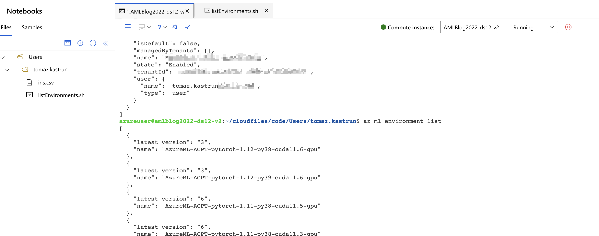

# Environments in Azure Machine Learning

Choosing the right set of components (CPU, GPU, RAM, Core) and corresponding software (OS, ML Framework, packages) can be time-consuming.

Under Curated environments, you will find predefined environments, with settings for running particular frameworks, like PyTorch or TensorFlow.


Fig.1: Curated environments


These environments are essentially Docker images and are designed for training, deploying, or inference.

Not only will you find a great description, tags and versions, but there is also a batch script for provisioning each of the environments (copied from the preparation script for the Docker image):

``` bash
FROM mcr.microsoft.com/azureml/aifx/stable-ubuntu2004-cu116-py39-torch1121:biweekly.202211.1
 
# Install pip dependencies
RUN pip install 'ipykernel~=6.0' \
                'azureml-core==1.47.0' \
                'azureml-dataset-runtime==1.47.0' \
                'azureml-defaults==1.47.0' \
                'azure-ml==0.0.1' \
                'azure-ml-component==0.9.15.post2' \
                'azureml-mlflow==1.47.0' \
        'azureml-contrib-services==1.47.0' \
                'azureml-contrib-services==1.47.0' \
                'torch-tb-profiler~=0.4.0' \
                'py-spy==0.3.12' \
                'debugpy~=1.6.3'
 
RUN pip install \
        azure-ai-ml==0.1.0b5 \
        MarkupSafe==2.1.1 \
        regex \
        pybind11
 
# Inference requirements
COPY --from=mcr.microsoft.com/azureml/o16n-base/python-assets:20220607.v1 /artifacts /var/
RUN /var/requirements/install_system_requirements.sh && \
    cp /var/configuration/rsyslog.conf /etc/rsyslog.conf && \
    cp /var/configuration/nginx.conf /etc/nginx/sites-available/app && \
    ln -sf /etc/nginx/sites-available/app /etc/nginx/sites-enabled/app && \
    rm -f /etc/nginx/sites-enabled/default
ENV SVDIR=/var/runit
ENV WORKER_TIMEOUT=400
EXPOSE 5001 8883 8888
 
# support Deepspeed launcher requirement of passwordless ssh login
 
RUN apt-get update
RUN apt-get install -y openssh-server openssh-client
RUN mkdir -p /root/.ssh
RUN mkdir /var/run/sshd
RUN ssh-keygen -t rsa -f /root/.ssh/id_rsa
RUN sed -i 's/PermitRootLogin without-password/PermitRootLogin yes/' /etc/ssh/sshd_config
RUN sed 's@session\\s*required\\s*pam_loginuid.so@session optional pam_loginuid.so@g' -i /etc/pam.d/sshd
RUN chmod 700 /root/.ssh/
RUN touch /root/.ssh/config;echo -e "Port 1043\n StrictHostKeyChecking no\n  UserKnownHostsFile=/dev/null" > /root/.ssh/config
RUN echo "Port 1043" >> /etc/ssh/sshd_config
RUN chmod 600 /root/.ssh/config
RUN touch /root/.ssh/authorized_keys && chmod 600 /root/.ssh/authorized_keys
RUN cat /root/.ssh/id_rsa.pub >> /root/.ssh/authorized_keys
EXPOSE 1043 1043
CMD ["/usr/sbin/sshd", "-D"]

```

These curated environments are provided by AML, and made available in your workspace. Microsoft keeps these environments up-to-date with the latest versions and releases and prepared as Docker images. Remember (!) these curated environments not only save time but will also save you costs when deployment time, because are optimally prepared.

# How to use them?

These curated environments are available using a azureml syntax for training or deployment. With the use of the function, you can get the environment ready.

``` bash
azureml:AzureML-ACPT-pytorch-1.12-py39-cuda11.6-gpu:3
//or 
azureml:AzureML-ACPT-pytorch-1.12-py39-cuda11.6-gpu@latest

```

You can also check the list of all available curated environments in the Azure ML Studio (which we did), or by using the Azure CLI (as viewed in Fig. 2) and running the command: 

``` bash 
az ml environments list
```

And get the list of available environments:


Fig.2: List of all environments using Azure CLI


You can see that figure 1 and figure 2 both give you the same list of environments for your faster jump-start.