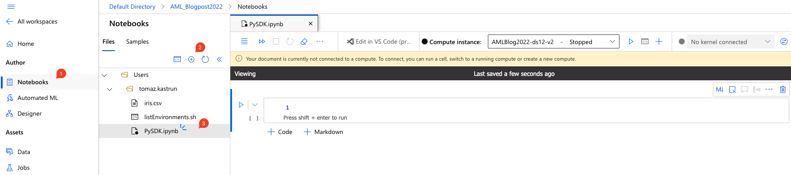
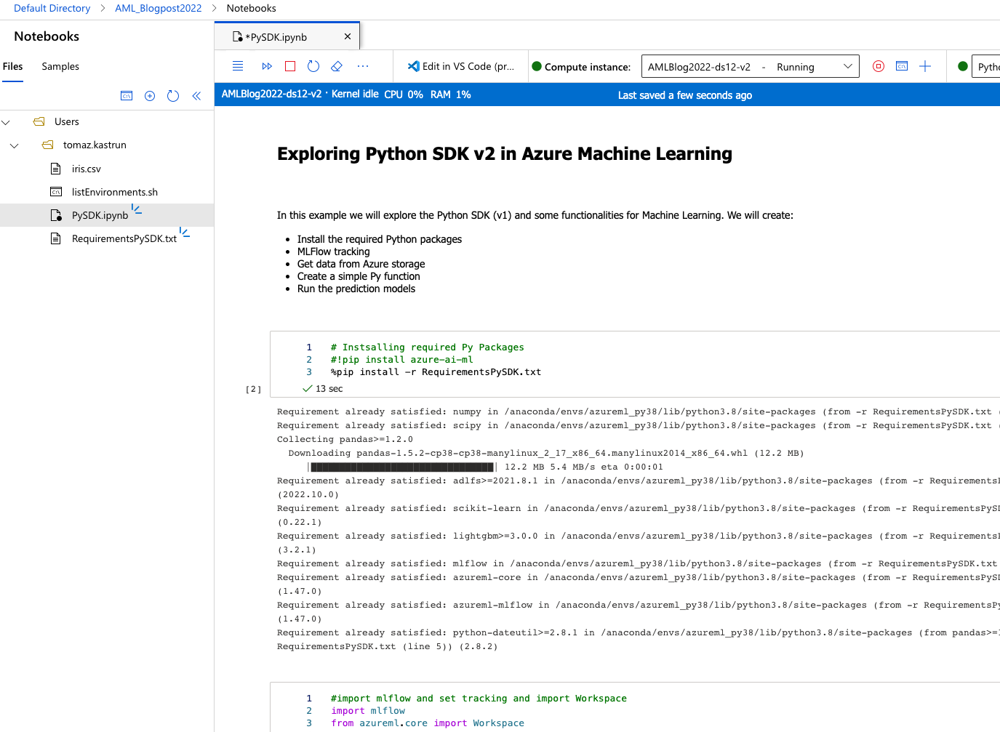
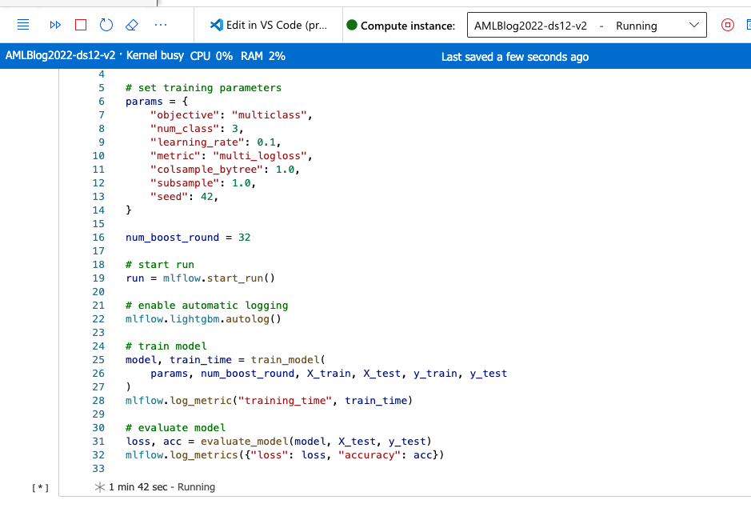
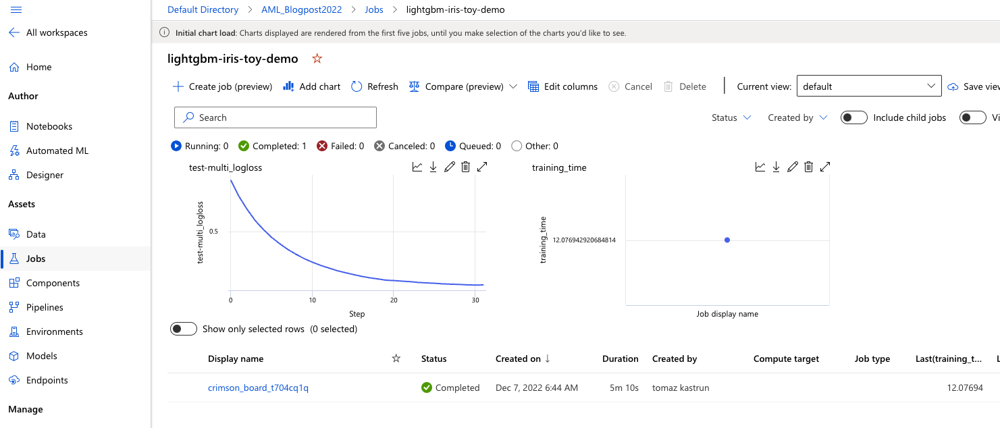
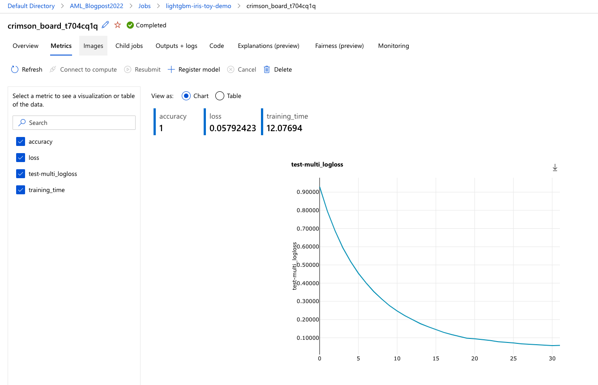

# Introduction to Azure CLI and Python SDK

What is Azure CLI? It is an Azure Command Line, a great tool for running commands out of CMD. It is a multi-platform and can be run from Azure or from the client’s machine. It is great for scripting and automating repetitive tasks or making the complex task look like lines of code, especially when it comes to infrastructure, managing, provisioning and monitoring. It can also be run from Azure Cloud Shell. It is native to Azure and can be used across all the services and offerings. Usually, the Azure CLI commands start with “az ..”. On top of that, you can also install Azure Machine Learning CLI, as an extension to Azure CLI. The AML CLI will give you additional commands to manage resources for machine learning.

The same functionality (to some extent) in Azure Machine Learning can be achieved with Python SDK. In addition to that, it offers also great ways to create and manage resources you use for training and deployment of models. And you can also create the following assets

* Environments
* Experiments
* ML Pipelines
* Compute
* Datasets
* Models
* Endpoints
* Monitoring and logging
* MLFlow
* Interact with your workspace

Now, let’s go in, and explore the Python SDK.

Go to Notebooks (1) and click on “+” sign (2) to create a new file. A dialogue window will pop up and select File type: “Notebook (*.ipynb) and give this file a name (e.g.: PySDK.ipynb). And start the compute instance (AMLBlog2022-ds12-v2), that we created in notebook (5-Creating-compute-and-cluster-instance-in-Azure.md).



Fig.1: Creating new iPython notebook


It is always a great practice, to include some Markdown text in your notebook. In addition, a good practice is also to create a requirements file, like: the “RequirementsPySDK.txt” file, where you specify the needed packages and versions for your workspace or notebook. In this case, I am adding the following packages in this txt file:

``` txt
# data science
numpy
scipy
pandas>=1.2.0
adlfs>=2021.8.1
scikit-learn
lightgbm>=3.0.0
 
# tracking
mlflow
 
# azureml
azureml-core
azureml-mlflow
```

And we can get started, by installing the packages stated in the requirements file.



Fig.2: Installing the required packages

After adding the functions, we can start running the training and evaluation of the model.


Fig.3: Training the model and capturing the log metrics with MLFlow

After the 32 rounds of training are finished, we can check the evaluation and logs from this model under Assets: “Jobs”. Select the **experiment** (we named it “lightgbm-iris-toy-demo”) and check the log loss results.



Fig.4: Analysing the log loss results of trained model

After going into the model itself and checking the Metrics, feature importance, logs and Explainability, Fairness and monitoring.




From here, it is also easy to register the model (for inference), by clicking on “+ Register model” and by doing so, it will appear in Assets: Models, giving you many more additional options and insights into the model:

* Conda YAML file for installation
* Python environment YAML file
* model.lgb file with detailed explanations and values (tree number, number of leaves, split feature, split gain, leaf gain, leaf weight, thresholds, internal weights and others)
* MLModel overview

Snippet of Python code:

``` python
import time
import lightgbm as lgb
from sklearn.metrics import log_loss, accuracy_score
from sklearn.preprocessing import LabelEncoder
from sklearn.model_selection import train_test_split
 
# define functions
def preprocess_data(df):
    X = df.drop(["species"], axis=1)
    y = df["species"]
 
    enc = LabelEncoder()
    y = enc.fit_transform(y)
 
    X_train, X_test, y_train, y_test = train_test_split(
        X, y, test_size=0.2, random_state=42
    )
 
    return X_train, X_test, y_train, y_test, enc
 
 
def train_model(params, num_boost_round, X_train, X_test, y_train, y_test):
    t1 = time.time()
    train_data = lgb.Dataset(X_train, label=y_train)
    test_data = lgb.Dataset(X_test, label=y_test)
    model = lgb.train(
        params,
        train_data,
        num_boost_round=num_boost_round,
        valid_sets=[test_data],
        valid_names=["test"],
    )
    t2 = time.time()
 
    return model, t2 - t1
 
 
def evaluate_model(model, X_test, y_test):
    y_proba = model.predict(X_test)
    y_pred = y_proba.argmax(axis=1)
    loss = log_loss(y_test, y_proba)
    acc = accuracy_score(y_test, y_pred)
 
    return loss, acc
 
 
# preprocess data
X_train, X_test, y_train, y_test, enc = preprocess_data(df)
 
# set training parameters
params = {
    "objective": "multiclass",
    "num_class": 3,
    "learning_rate": 0.1,
    "metric": "multi_logloss",
    "colsample_bytree": 1.0,
    "subsample": 1.0,
    "seed": 42,
}
 
num_boost_round = 32
 
# start run
run = mlflow.start_run()
 
# enable automatic logging
mlflow.lightgbm.autolog()
 
# train model
model, train_time = train_model(
    params, num_boost_round, X_train, X_test, y_train, y_test
)
mlflow.log_metric("training_time", train_time)
 
# evaluate model
loss, acc = evaluate_model(model, X_test, y_test)
mlflow.log_metrics({"loss": loss, "accuracy": acc})

```


Compete notebook with Python code is available at the GitHub repository in the notebooks folder: https://github.com/tomaztk/Azure-Machine-Learning/notebooks