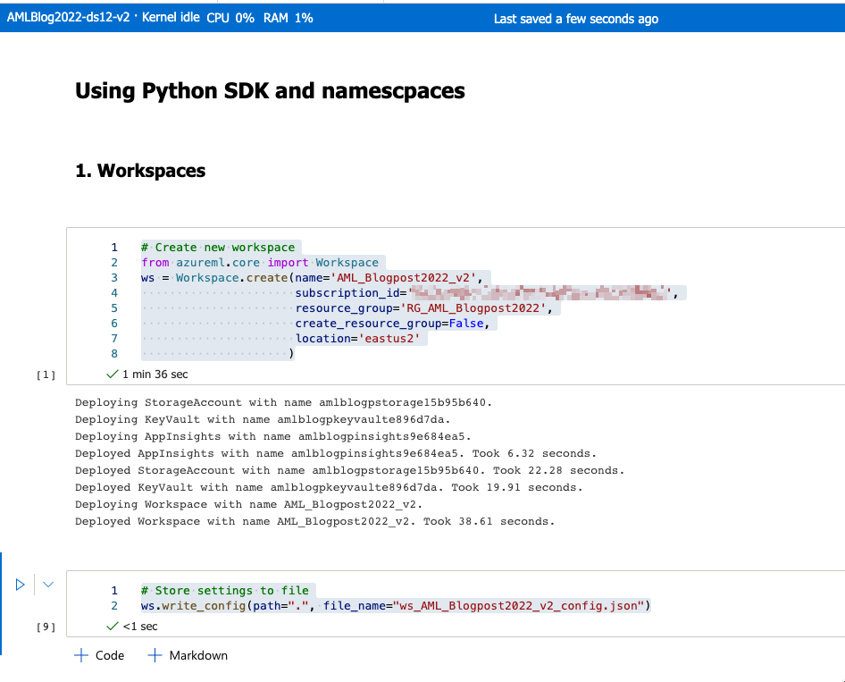
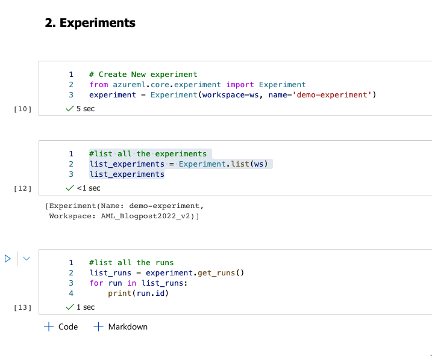
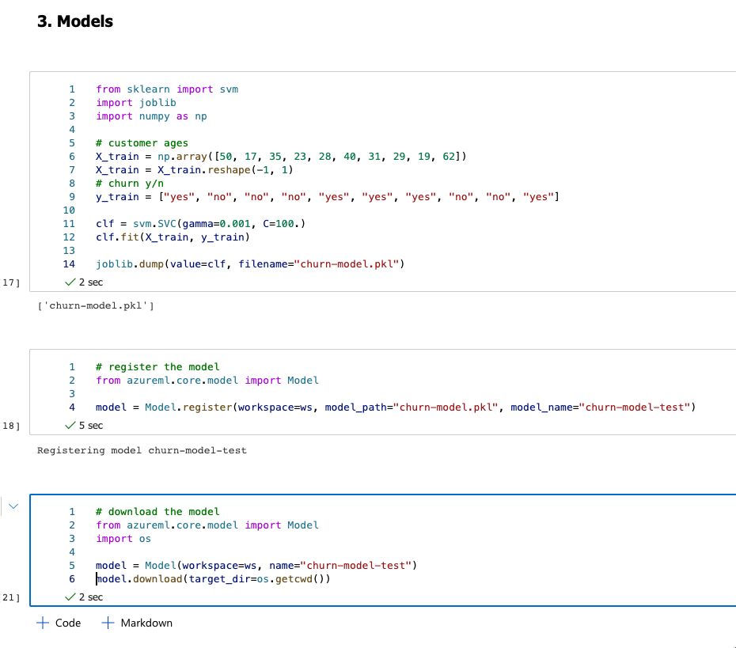

# Python SDK namespaces for workspace, experiments and models

Looking briefly into Azure CLI and Python SDK, let’s explore the power of SDK and the most important namespaces.

Create a new notebook (mine is called “Namespaces_SDK.ipynb”) and attach a compute to the notebook. We will be interacting with a Python environment, using Jupyter notebooks (or Visual Studio Code, if you prefer) and explore the SDK namespaces for:

* Exploring, preparing and managing experiments
* managing resource for the experiments
* training and configuring the models, hyperparameter settings and finding best predictions
* deploying the models (including REST)

I will go through the most important namespaces.

## Workspace

The full name for the namespace is  azureml.core.workspace.Workspace with additional classes available, that I will not be covering.

One sample of a class is to create worskapce.


``` python
# Create new workspace
from azureml.core import Workspace
ws = Workspace.create(name='AML_Blogpost2022_v2',
                      subscription_id='{your-subscription-guid}',
                      resource_group='RG_AML_Blogpost2022',
                      create_resource_group=False,
                      location='eastus2'
                     )
```
And for example, store the settings in JSON file:

```python
# Store settings to file
ws.write_config(path=".", file_name="ws_AML_Blogpost2022_v2_config.json")
```


Fig 1: Creating workspace

To double-check, you can go to default directory and see there is another workspace created.

## Experiments

The full name for the namespace is   azureml.core.experiment.Experiment. It lets you create an experiment and manage it, run it and more.

And we can get started, by installing the packages stated in the requirements file.

```python
from azureml.core.experiment import Experiment
experiment = Experiment(workspace=ws, name='demo-experiment')
 
#list all the experiments
list_experiments = Experiment.list(ws)
list_experiments
```

You can also get all the runs for this experiment:

```python
list_runs = experiment.get_runs()
for run in list_runs:
    print(run.id)
```


Fig 2: Creating new experiment and checking all the runs

## Model

The namespace for a run: azureml.core.model.Model and use model registration to store and version your models in the Azure cloud, in your workspace. Registered models are identified by name and version.

Create a simple model:

```python
from sklearn import svm
import joblib
import numpy as np
 
# customer ages
X_train = np.array([50, 17, 35, 23, 28, 40, 31, 29, 19, 62])
X_train = X_train.reshape(-1, 1)
# churn y/n
y_train = ["yes", "no", "no", "no", "yes", "yes", "yes", "no", "no", "yes"]
 
clf = svm.SVC(gamma=0.001, C=100.)
clf.fit(X_train, y_train)
 
joblib.dump(value=clf, filename="churn-model.pkl")
```

And you can register the model:

```python
from azureml.core.model import Model
 
model = Model.register(workspace=ws, model_path="churn-model.pkl", model_name="churn-model-test")
```


Fig 3: creating and registering the model

