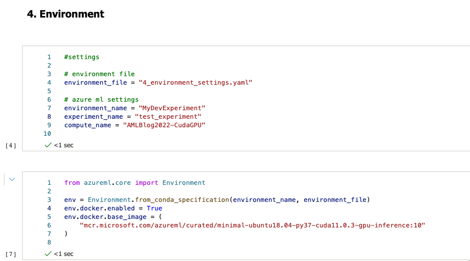
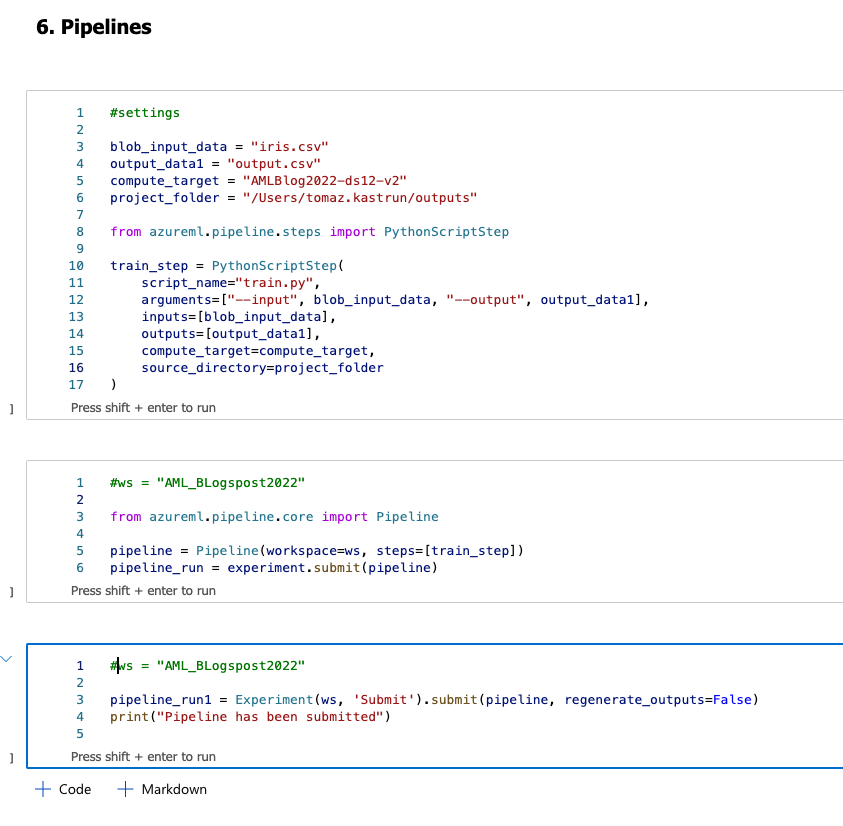
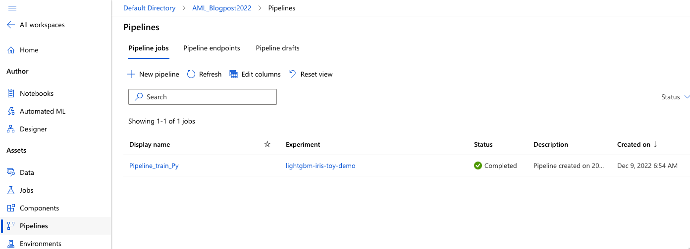

# Python SDK namespaces for environment, and pipelines

## Environment

Python SDK namespace is azureml.core.environment. Environments specify the set of Python packages, environment variables, and software settings around your training and scoring scripts. In addition to Python, you can also configure PySpark, Docker and R for environments.

You can use namespace  Environment (or created object/asset) to make deployment and code reusable for training purposes at given docker images, configurations and compute type.

The general script is:

```python
from azureml.core.environment import Environment
Environment(name="MyDevEnvironment")
```

but you can use a Docker image and scale faster with:

```python
# environment variables
environment_file = "4_environment_settings.yaml"
environment_name = "MyDevEnvironmentDocker"
 
from azureml.core import Environment
 
env = Environment.from_conda_specification(environment_name, environment_file)
env.docker.enabled = True
env.docker.base_image = (
    "mcr.microsoft.com/azureml/curated/minimal-ubuntu18.04-py37-cuda11.0.3-gpu-inference:10"
)
```


Fig. 1: Environment settings

And we have a YAML file with stored dependencies for the Conda specifications. It hold the following instructions:

```txt
channels:
  - conda-forge
dependencies:
  - python=3.9
  - pip
  - pip:
    - azureml-defaults
    - torch==1.8.1
    - torchvision==0.9.1
    - pytorch-lightning==1.1.8
    - mlflow
    - azureml-mlflow
```

## Pipelines

Namespace for the pipeline in SDK is `azureml.pipeline.core.pipeline`.Pipeline. Pipeline is an automated workflow of a compute task. There can be many subtasks within a pipeline and are a series of instructions. It varies, from simple pipelines, like calling a single script (py file) to a series of steps for data preparation, logging and training configurations, training and validating for efficient repeatability, and deployment steps

An Azure Machine Learning pipeline is an automated workflow of a complete machine learning task. Subtasks are encapsulated as a series of steps within the pipeline. An Azure Machine Learning pipeline can be as simple as one step that calls a Python script. Pipelines include functionality for:

Namespace for step in SDK is `azureml.pipeline.steps`. A step is a single encapsulated instruction that creates a pipeline. We will take a single script name and use a function (in this namespace)

 It takes a script name and other optional parameters like arguments for the script, compute target, inputs and outputs. The following code is a simple example of a `PythonScriptStep`.

```python
#settings
 
blob_input_data = "iris.csv"
output_data1 = "output.csv"
compute_target = "AMLBlog2022-ds12-v2"
project_folder = "/Users/tomaz.kastrun/outputs"
 
from azureml.pipeline.steps import PythonScriptStep
 
train_step = PythonScriptStep(
    script_name="train.py",
    arguments=["--input", blob_input_data, "--output", output_data1],
    inputs=[blob_input_data],
    outputs=[output_data1],
    compute_target=compute_target,
    source_directory=project_folder
)
```

And once we have at least one step, we can create a pipeline.

```python
ws = "AML_BLogspost2022"
 
from azureml.pipeline.core import Pipeline
 
pipeline = Pipeline(workspace=ws, steps=[train_step])
pipeline_run = experiment.submit(pipeline)
```


Fig2.: Overview of the pipeline script

Pipelines needs to be published at the end:

```python
ws = "AML_BLogspost2022"
 
pipeline_run1 = Experiment(ws, 'Submit').submit(pipeline, regenerate_outputs=False)
print("Pipeline has been submitted")
```


Fig 3: Submitted pipeline

Each pipeline must have a compute attached!