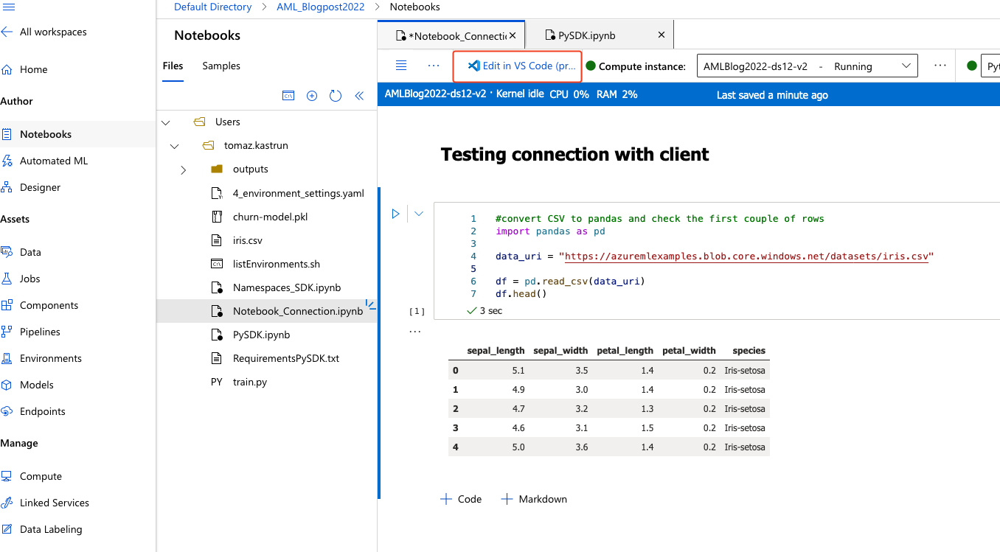
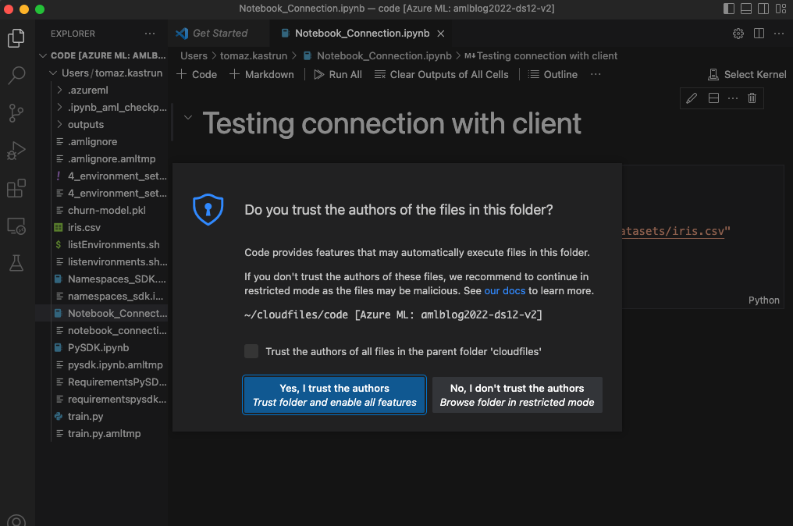
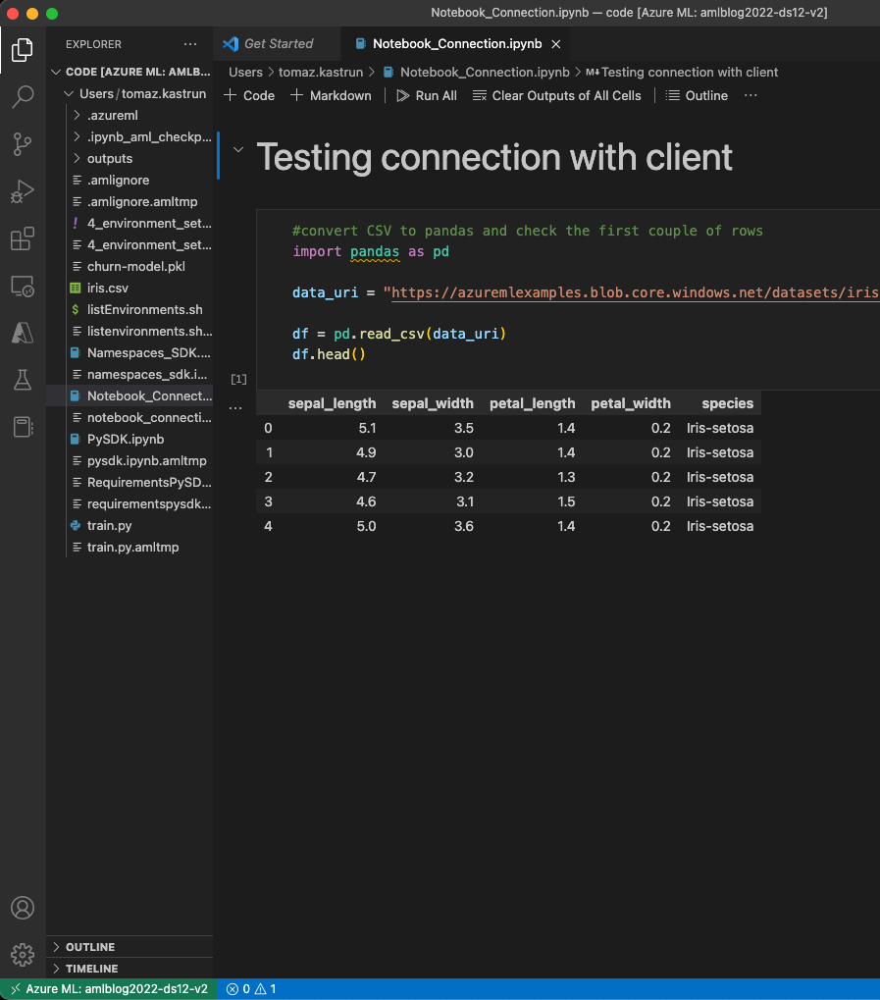

# Connecting to client using Python SDK namespaces


Let’s continue to explore the power of SDK and the namespaces. And we will look into namespace that will help you connect to Azure ML resources with Python SDK.

## Connecting with Visual Studio Code

For this demonstration, I will create a new notebook (IPynb) and write a couple of Python code. And you can click on “Edit in VS Code (preview)”



Fig.1: Accessing VS Code

You will be redirected to Visual studio code. From there you will be able to write, validate and execute your Python code.


Fig.2: Using Azure ML Python SDK and resource in VS Code

At the bottom of your VS Code, you will find the connection to Azure and the name of the workspace. In order to do so, you will need to have VS Code installed with some additional extensions: Azure extension, Python and Jupyter extensions and Python packages for accessing the storage or other service.

Everything you write in VS Code will be automatically saved in the workspace in Azure ML. This is because you are opening the entire workspace locally through VS Code and all changes are stored on the cloud.

## Using AzureML namespace in Python code

The next step is to have a simple Python code execute the authentication to Azure ML Workspace and to start using the assets in Azue ML.


Fig 3.: Using Jupyter notebook on local machine

By using a Jupyter notebook on a local machine, I can access the assets to Azure ML workspace and run all the commands on a local machine.

```python
# !pip install azure-ai-ml
# !pip install azureml-core
 
# authorization
from azureml.core.authentication import InteractiveLoginAuthentication
interactive_auth = InteractiveLoginAuthentication(tenant_id="xxxxxxxx-tenantID-xxxxxxxxxx", force=True)
from azureml.core import Workspace
 
subscription_id = "xxxxxxx-subscriptionID-xxxxxxxxxxx"
resource_group = "RG_AML_Blogpost2022"
workspace_name = "AML_Blogpost2022"
 
ws = Workspace(subscription_id, resource_group, workspace_name)
 
# check the workspace
 ws.get_details()
 
#list all the experiments
from azureml.core.experiment import Experiment
list_experiments = Experiment.list(ws)
list_experiments
```

If want to use a Token for authorisation or any other authorisation? Here is a comprehensive list of all possible authentications is [here](https://github.com/Azure/MachineLearningNotebooks/blob/master/how-to-use-azureml/manage-azureml-service/authentication-in-azureml/authentication-in-azureml.ipynb) in Jupyter notebook.