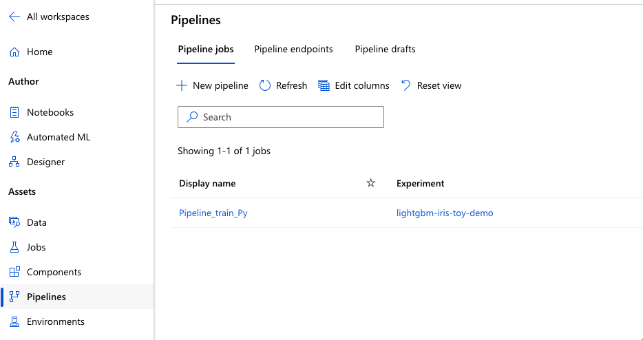
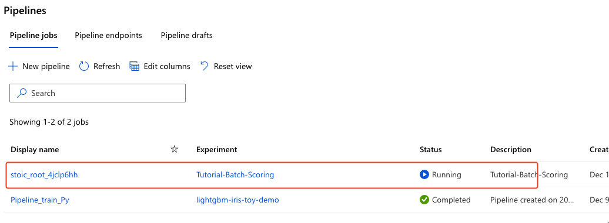
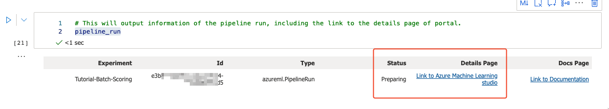
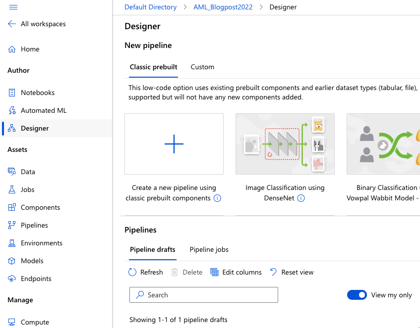
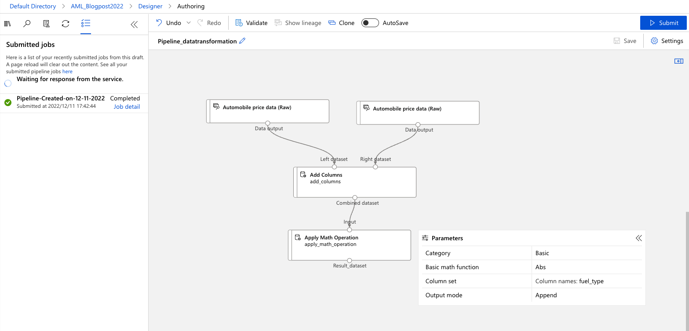

# Creating Pipelines with Python SDK

A pipeline is set of instructions (or a workflow) for executing particular work of a machine learning task. The idea behind pipelines is that will help the team of data scientists and machine learning engineers standardize workflow and incorporate best practices of preparing data, producing training models, executing the models and deploying them. Pipelines will help improve and build workflow efficiently and in such a way that it can be reusable.

And the idea behind it, is to split a machine learning process into smaller tasks, a multistep workflow, where each step is a separate component than can be developed, upgraded, optimised, configured, automated, and deleted separately. And these steps, connected through interfaces, form a workflow.

Pipelines can be created using a Designer, with Python SDK or with Azure CLI.


Fig 1: Pipeline assest

Under Assets, there are Pipeline Jobs, Pipeline endpoints and pipeline drafts. Pipeline jobs are the multi-step standardised ways to do any type of machine learning task. Pipeline endpoints are endpoints, that invoke the jobs from external systems and can be managed repeatedly for batch scoring and retraining scenarios.

Now, let’s focus on creating pipelines.

## Using Python SDK

Creating pipelines with the following code:

```python
from azureml.core import Experiment
from azureml.pipeline.core import Pipeline
 
pipeline = Pipeline(workspace=ws, steps=[batch_score_step])
pipeline_run = Experiment(ws, "Tutorial-Batch-Scoring").submit(pipeline)
```

Creates a new pipeline for batch scoring



Fig 2. Running pipelines

And with the:

```python
pipeline_run
```

We can check the status of pipeline



Fig 3: Checking the status of pipeline (Status: preparing)

And pipeline was create using Python SDK and the ParallelRunStep function.

```python
from azureml.pipeline.steps import ParallelRunStep
from datetime import datetime
import uuid
 
parallel_step_name = "batchscoring-" + datetime.now().strftime("%Y%m%d%H%M")
 
label_config = label_ds.as_named_input("labels_input").as_mount("/tmp/{}".format(str(uuid.uuid4())))
 
batch_score_step = ParallelRunStep(
    name=parallel_step_name,
    inputs=[input_images.as_named_input("input_images")],
    output=output_dir,
    arguments=["--model_name", "inception",
               "--labels_dir", label_config],
    side_inputs=[label_config],
    parallel_run_config=parallel_run_config,
    allow_reuse=False
)
```

Complete code is available on GitHub and consists of Notebook, YAML file and Python code.

All three files are prefixed with “Day11-” and are stored in “notebook” folder.

## Designer

Another way to create pipelines is by using a Designer. When in Assets Pipelines, click on “+ New Pipeline” and you will be directed to Designer.



Fig 4: Creating pipeline with Designer


You can create a pipeline from prebuilt pipelines or simply create new.


Fig 5: Submitting pipeline in Designer

After completion, the pipeline will also appear under the pipelines. Each pipeline creation, submitting, and run, must have a compute also available. And this applies, both to Python SDK, Designer and Azure CLI.