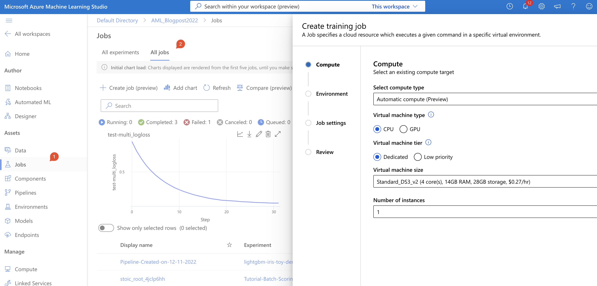
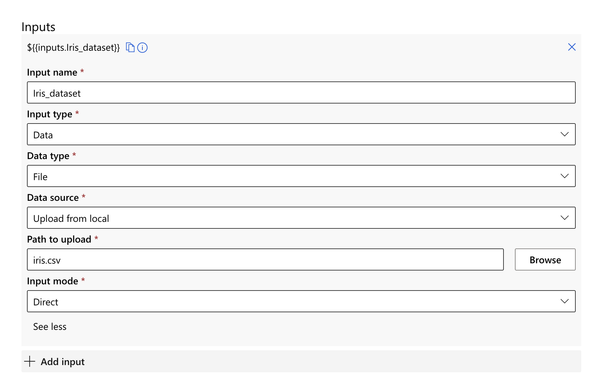

# Creating jobs


An Azure ML job executes a task against a specified compute target. This is also how the job is created. By configuring a new job, you can also scale out model training, since there are single node and distributed training available.

A simple job command would be to execute a command in a Docker container. And further parameter sweeping can be executed, by specifying it in the job itself. Job will need the following components:

* Compute
* Data source
* Code source
* Environment
* inputs and outputs


Jobs also enable systematic tracking for your ML experimentation and workflows. Once a job is created, Azure ML maintains a run record for the job that includes the metadata, any metrics, logs, and artefacts generated during the job, code that was executed, and the Azure ML environment used.

In Studio, click on Jobs (under Assets in navigation bar) and select “all jobs”.


Fig. 1: creating a new job

You will see that from this point on, the process is relatively straightforward. You only need to have all the “ingredients” prepared in advance.

## Compute
For compute, I will be using the already created compute (Day 5, we created a compute).

Select compute type: _compute instance_
Select Azure ML compute instance: _AMLBlog2022-ds12-v2_

We proceed to the next step.

## Environment
For this type of job, we will be using a curated environment with LightGBM.

Select Environment type: _Curated environments_
Choose environment: _LightGBM 3.2_

We proceed to the next step.

## Job Settings
In this step, we will define the model, data, etc.

Name: _Training IRIS_
Experiment name: _default_
Code: Choose local file -> I am adding file Day4_train.py (file is on Github)
Enter the command to start: _“Python day4_train.py“_

Under the inputs, I have added the data file:


Fig 2: Configuring data inputs

There are no environmental variables, so I leave this out. The distributed training,

Distributed Type: _Mpi_
Number of nodes: _1_

And add some tags.

## Review

After creating all the steps, you can close the job creating with the review.

The YAML Specs:

```YAML
$schema: 'https://azuremlschemas.azureedge.net/latest/commandJob.schema.json'
environment: 'azureml:AzureML-lightgbm-3.2-ubuntu18.04-py37-cpu:48'
command: 'python Day4_train.py  --data${{inputs.Iris_dataset}}'
compute: 'azureml:AMLBlog2022-ds12-v2'
resources:
  instance_count: 1
experiment_name: lightgbm-iris-toy-demo
display_name: Training IRIS
```

Once the job is created, you can view it under jobs.

This job can now be run, and each run can also be analysed on the same metrics.