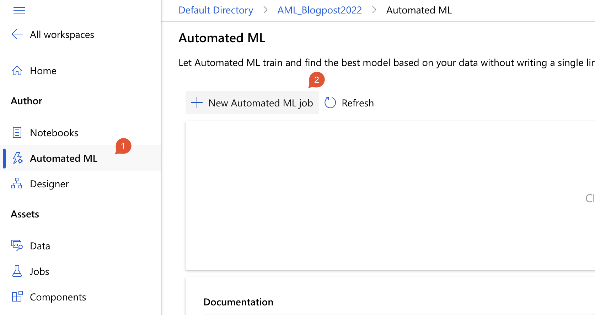
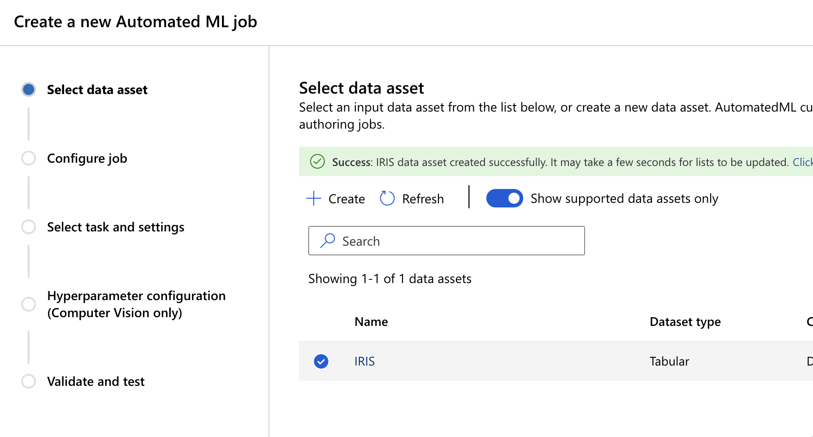
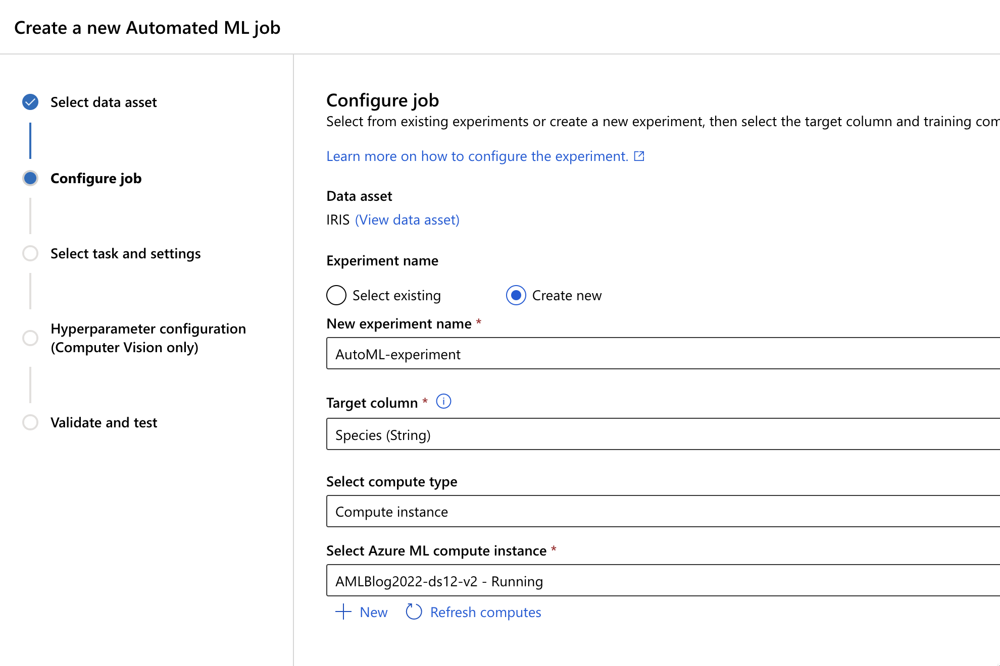
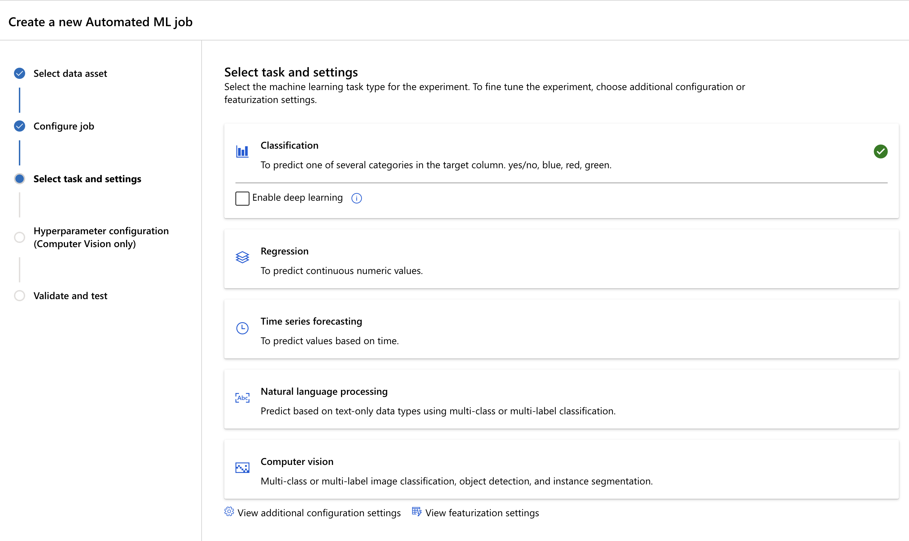
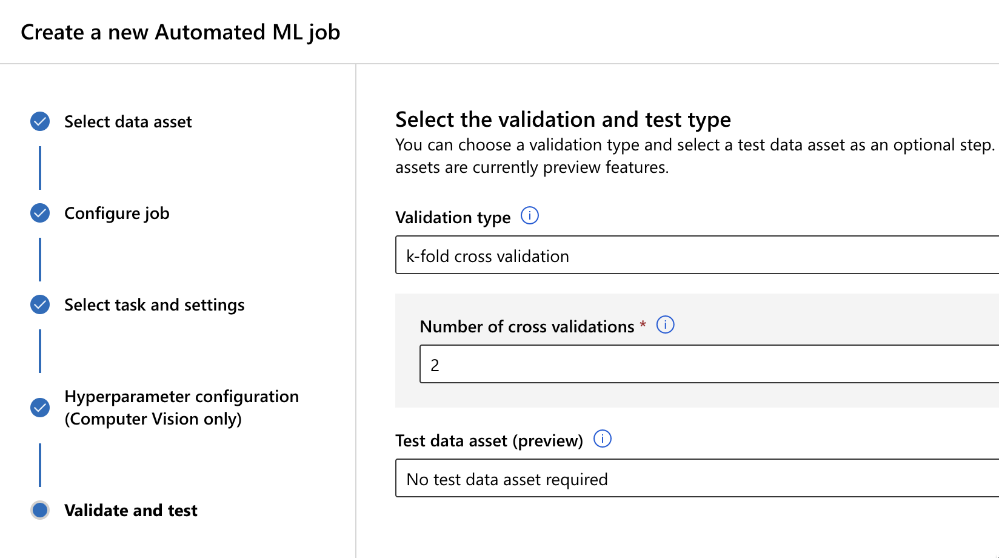
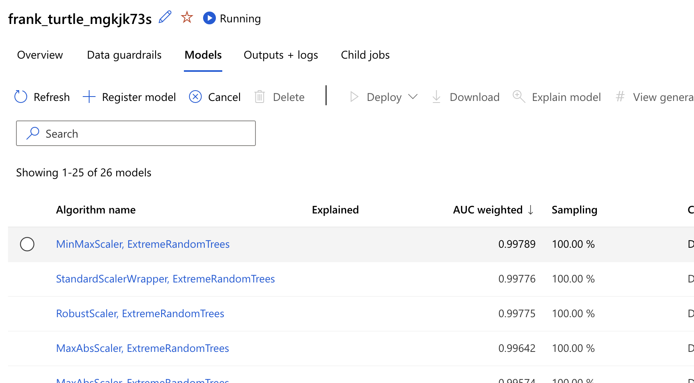
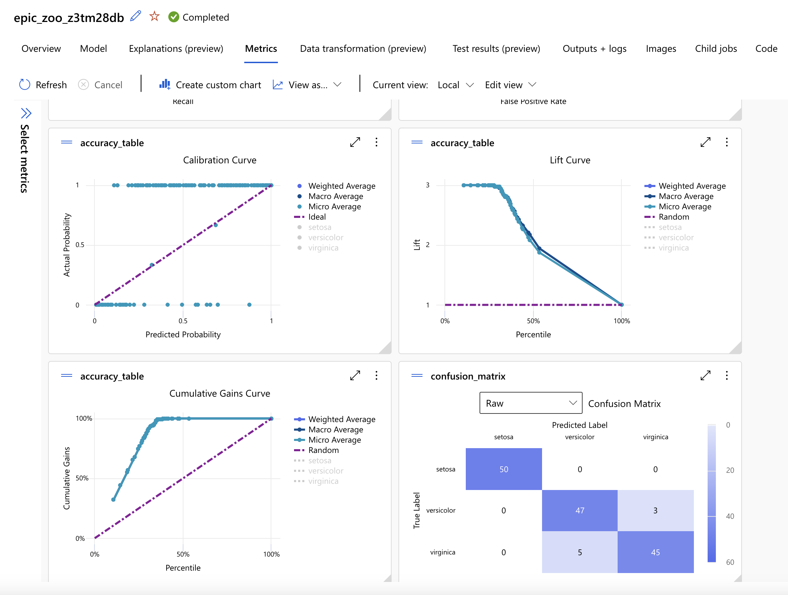
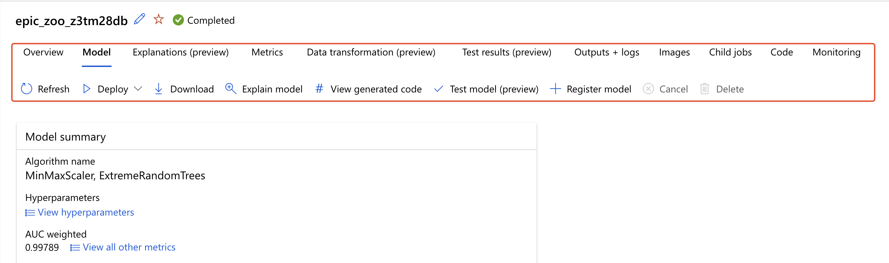

# Automated ML

Automated ML is a no-code automated machine learning task. It iterates over many combinations of algorithms and hyperparameters in order to find the best model for your dataset and your prediction variable(s). The final solution is a model, that can be downloaded and later reused. So Automated ML is not just giving you the best model out of a family of algorithms, but lets you use the model, generate the scripts and create the artefacts.

Under section “Author” in navigation bar, select Automated ML and click “+ New Automated ML job”.

Fig 1: Starting Automated ML

There will be roughly 4 steps following in order to start the process.

## Select the Data

In this step, you will define what is your dataset and how does the schema looks. Take the data from your Azure Blob, Azure SQL, external source or local file. Once you define the source/origin of your data, make sure that the schema is also correct – data types, number and date formats, headers, values.

Fig. 2: Configuring the data

Once you have this steps though, you proceed to the next step

## Configure Job

In this step, you will configure a job. In order to do so, you will provide the experiment name, the compute type and the compute instance. In addition, you must also define the Target column for your prediction model, as this will be relevant for the next step.

Fig. 3: Configuring a job

## Selecting task and settings

This is the step, where you will define the type of machine learning process you want to do. There are several types, from Classification, Regression to Time series forecasting, Natural language processing, to Computer vision.

Fig 4: Define the type of experiment

By default, the system gives you a hint, to choose (based on the data), but you can change this, as well. But since the nature of my dataset and my target variable (and also compute instance), the classification is the correct type.

Make sure to check “View additional configuration settings” to set the primary metrics, exit criteria, and any additional settings for the algorithms.

## Validation and test

The last step is to define a validation type and select a test data asset as an optional step. with Validation, you can leave it as auto, or you can choose between k-fold cross validation, Monte Carlo cross-validation or Train-validation split or User validation data. I will go with a k-fold and set it to 2-folds.

Fig 5: Selecting validation test

Click Finish and let Automate ML do everything for you. In meantime, grab a coffee, or you can look at an episode of Seinfeld or do some sports.

## Explore the models

Once the process of Auto ML is finished (or still during the run) you want to explore the models. Make sure to check on “Data Guardrails” to be assured, there are no imbalanced data, high cardinality data, or issues with missing data and imputation. On the models tab, you will find the models sorted by desired output metric (in my case AUC weighted).

Fig 6: Selecting the best model

If you select one of the models, you can further explore it.

Fig 7: Exploring the accuracy of the model

There are also many other rich features available for the model. You can download the model, run the explain the model (great feature), can download the generated Auto ML code, so you can always run the same experiment for this model, and you can also register the model.

Fig 8: additional features

In addition, you can also check the outputs, child runs and monitoring for the complete Auto ML experiment. Exported code will be available on GitHub.

