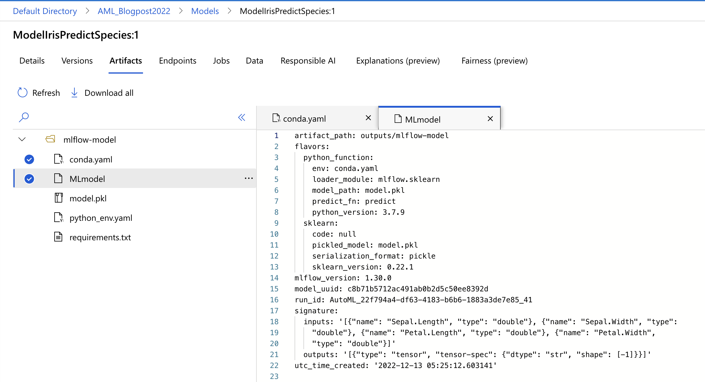

# Registering the models

Important asset is the “Models” in navigation bar. This feature allows you to work with different model types -> custom, MLflow, and Triton. What you do here is, you register a model from different locations (e.g.: local file, AzureML Datastore, AzureML Job, MLflow Job, Model asset in AzureML workspace, and Model asset in AzureML Registry).

Once you open the Models asset, you will see, that you can do many things here. I have already model register from the running the notebook on day4.

Fig 1: Opening a Model asset.

Registering model is the most imporant step, but before you jump on it, make sure that you have the MLflow, Tritor on custom logs of the model training. Luckly, we have one from the Automated ML. Click on the “+ Register” and select “From a job output”. And make sure that you select a model from AutoML-experiment – as this is how we named our experiment.

Because the AutoML has built-in MLflow model registering and tracking, the model registration in this step (as seen on Figure 2) is thus simpler.

Fig 2: Selecting model output

Give it a name, a version and register the model.

You can futher explore the model by going through the versions of the model (you can do that, with the help of MLflow), artifacts, Endpoints, and also Responsible AI, Explanagions and Fairness.

Fig 3: Model exploration
