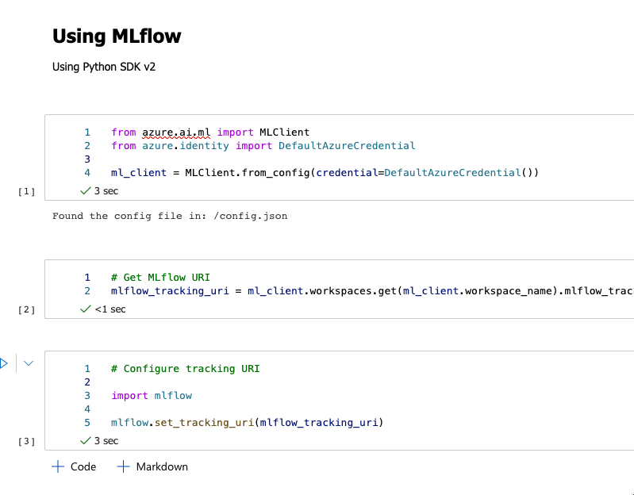

# Getting to know MLflow

MLFlow is an open-source framework for registering, managing and tracking machine learning models. It is multiplatform, bringing consistent model training and model consumption across different platforms. This means, that training a model locally and uploading it to Azure or training a model on remote compute instances and downloading it, is a great feature for MLflow.

You can use MLflow with Azure CLI, Azure Python SDK or in the studio and it will deliver a consistent experience (note, some functionalities are limited to the language).

It offers model registering and logging, and model deployment.

By opening a new notebook and attaching it to the compute, you can start setting up the MLflow.

Fig 1: Setting up Tracking in MLflow

And we can also view the metrics and also artefacts.

Fig 2: Checking the metrics

We use couple of important methods within the mlflow namespace:

* MLClient – to setup the credentials and getting the job runs and viewing metrics
* mlflow – to create and set the tracking URI and set the experiment

