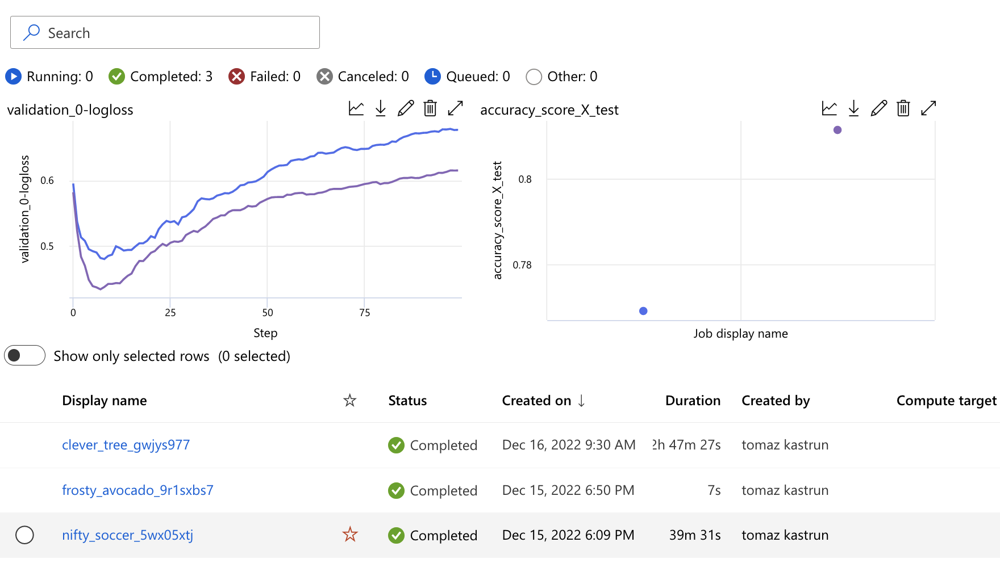

# MLflow in action with xgboost


We will create a new notebook and use Heart dataset (link to dataset) to toy around. We will also import xgboost classifier to asses the accuracy of the presence of heart disease in the patient. We will be using a categorical (integer) variable with values from 0 (no presence) to 4 (strong presence) and attempt to classify based on 15+ attributes (out of more than 70 attributes).

The ipynb notebook will be available on the Github.


```python
#importing mlflow functions
import mlflow
mlflow.set_experiment(experiment_name="heart-condition-classifier")
 
#getting the data
import pandas as pd
file_url = "http://storage.googleapis.com/download.tensorflow.org/data/heart.csv"
df = pd.read_csv(file_url)
 
#some data engineering
df["thal"] = df["thal"].astype("category").cat.codes
 
#split train and test
from sklearn.model_selection import train_test_split
 
X_train, X_test, y_train, y_test = train_test_split(
    df.drop("target", axis=1), df["target"], test_size=0.4
)
 
#logging the steps
mlflow.xgboost.autolog()
 
#training the model
from xgboost import XGBClassifier
 
model = XGBClassifier(use_label_encoder=False, eval_metric="logloss")
 
#  start the  mlflow run
run = mlflow.start_run()
 
#start fitting the model
model.fit(X_train, y_train, eval_set=[(X_test, y_test)], verbose=False)
 
#logging some extra metrics
y_pred = model.predict(X_test)
 
from sklearn.metrics import accuracy_score, recall_score, fbeta_score, confusion_matrix
 
accuracy = accuracy_score(y_test, y_pred)
recall = recall_score(y_test, y_pred)
cm = confusion_matrix(y_test, y_pred)
 
#closing mlflow
mlflow.end_run()
run = mlflow.get_run(run.info.run_id)
client = mlflow.tracking.MlflowClient()
```

We can also do the logging with preprocessing.

```python
# Reload the dataset
df = pd.read_csv(file_url)
 
from sklearn.model_selection import train_test_split
 
X_train, X_test, y_train, y_test = train_test_split(
    df.drop("target", axis=1), df["target"], test_size=0.3
)
 
#using ordinal encoder
 
import numpy as np
from sklearn.preprocessing import OrdinalEncoder
 
# creating transformation and using Logloss on xbgoost classifies
from sklearn.compose import ColumnTransformer
from xgboost import XGBClassifier
 
encoder = ColumnTransformer(
    [
        (
            "cat_encoding",
            OrdinalEncoder(
                categories="auto",
                handle_unknown="use_encoded_value",
                unknown_value=np.nan,
            ),
            ["thal"],
        )
    ],
    remainder="passthrough",
    verbose_feature_names_out=False,
)
 
model = XGBClassifier(use_label_encoder=False, eval_metric="logloss")

```

With mulitple runs, you can also check the performance of models with desired metrics. This is an example of logloss validation and comparison between two runs.



Fig 1: Comparison of models