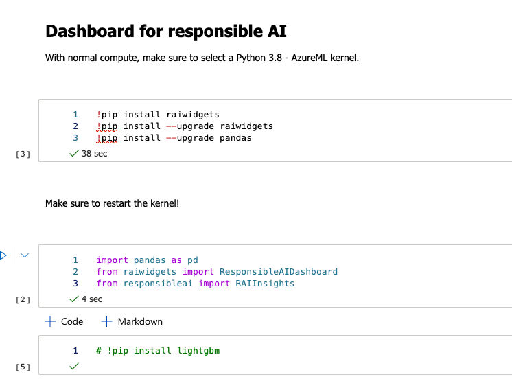
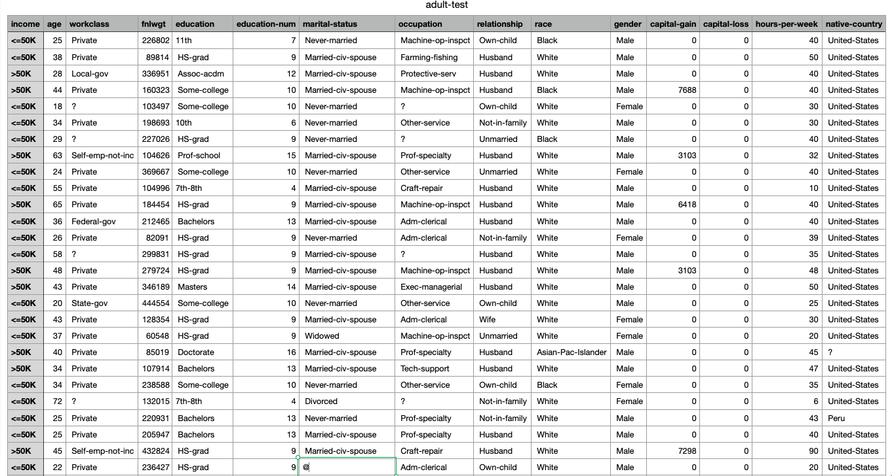

# Building responsible AI dashboard with Python SDK

Responsible AI is an approach to assessing, developing, and deploying AI systems in a safe, trustworthy, and ethical manner, and take responsible decisions and actions (source: Responsible AI toolbox is available at Microsoft’s Github ).

Azure ML has provided users with collection of model and data exploration with the Studio user interface. But it also provides compatible solutions with Azure ML and Python package responsibleai. With the help of widgets, we will create an sample of dashboard to explore the solution with assessing the responsible decisions and actions.

Create a new Notebook and do all the needed installations of packages! Once you install the raiwidgets, make sure to restart the kernel!

I am using Python 3.8 with AzureML kernel! And installation process is flawless.


Fig 1: Providing needed python packages


I am using Adult dataset with income as Y-variable and all other demographic variables (X-variables) to use in formula to train and test the model.


Fig 2: outline of the dataset

And I will be using following code to split and train the model:


```python
def create_classification_pipeline(X):
    pipe_cfg = {
        'num_cols': X.dtypes[X.dtypes == 'int64'].index.values.tolist(),
        'cat_cols': X.dtypes[X.dtypes == 'object'].index.values.tolist(),
    }
    num_pipe = Pipeline([
        ('num_imputer', SimpleImputer(strategy='median')),
        ('num_scaler', StandardScaler())
    ])
    cat_pipe = Pipeline([
        ('cat_imputer', SimpleImputer(strategy='constant', fill_value='?')),
        ('cat_encoder', OneHotEncoder(handle_unknown='ignore', sparse=False))
    ])
    feat_pipe = ColumnTransformer([
        ('num_pipe', num_pipe, pipe_cfg['num_cols']),
        ('cat_pipe', cat_pipe, pipe_cfg['cat_cols'])
    ])
 
    # Append classifier to preprocessing pipeline.
    # Now we have a full prediction pipeline.
    pipeline = Pipeline(steps=[('preprocessor', feat_pipe),
                               ('model', LGBMClassifier(random_state=0))])
 
    return pipeline
 
target_feature = 'income'
categorical_features = ['workclass', 'education', 'marital-status',
                        'occupation', 'relationship', 'race', 'gender', 'native-country']
 
 
train_data = pd.read_csv('adult-train.csv', skipinitialspace=True)
test_data = pd.read_csv('adult-test.csv', skipinitialspace=True)
 
X_train_original, y_train = split_label(train_data, target_feature)
X_test_original, y_test = split_label(test_data, target_feature)
 
pipeline = create_classification_pipeline(X_train_original)
 
y_train = y_train[target_feature].to_numpy()
y_test = y_test[target_feature].to_numpy()
 
test_data_sample = test_data.sample(n=500, random_state=5)
model = pipeline.fit(X_train_original, y_train)
```

With 500 iterations, we will rung this classification problem, using ligthgbm LGBMClassifier.


```

```