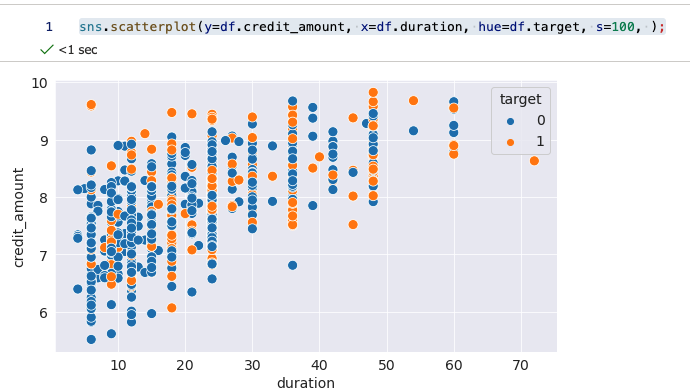
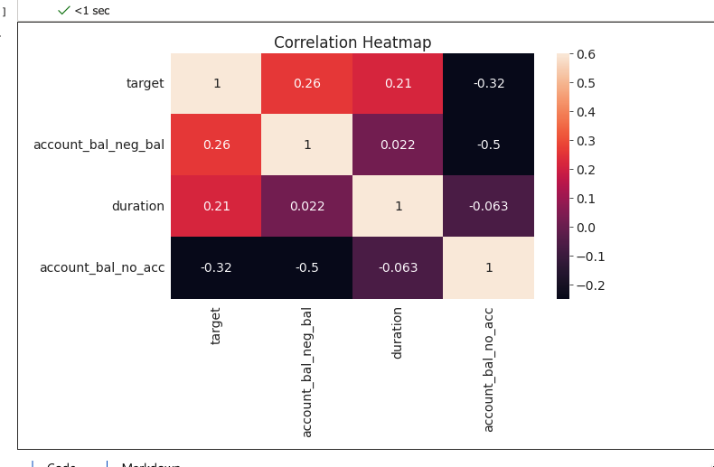

# Statistical analysis, plotting graphs and feature engineering

Azure Machine Learning is also a great tool to do ordinary statistical analysis, graph plotting and everything that goes along.

Let’s get an open dataset, that is available on UCI Machine Learning repository and import it in the pandas dataframe.

We can also first save it to the notebook:

```Python
import pandas as pd
df = pd.read_csv('http://archive.ics.uci.edu/ml/machine-learning-databases/statlog/german/german.data', delimiter=' ',header=None)
df.columns=['account_bal','duration','payment_status','purpose',
                   'credit_amount','savings_bond_value','employed_since',
                   'installment_rate','sex_marital','guarantor','residence_since',
                   'most_valuable_asset','age','concurrent_credits','type_of_housing',
                   'number_of_exist_cr','job','number_of_dependents','telephone',
                   'foreign','target']
 
df= df.replace(['A11','A12','A13','A14', 'A171','A172','A173','A174','A121','A122','A123','A124'],
                  ['neg_bal','positive_bal','positive_bal','no_acc','unskilled','unskilled','skilled','highly_skilled',
                   'none','car','life_insurance','real_estate'])
```

We will be using the target variable further in analysis to check, how we can do the predictions. So let’s first check the missing values:

```python
# check for missing values
df.isna().any().any()
```

And now the distribution of target variable:

```py
from sklearn.preprocessing import LabelEncoder
 
le= LabelEncoder()
le.fit(df.target)
df.target=le.transform(df.target)
```

And check the loans:

```py
loans_good_bad=round(((df.target.value_counts()/df.target.count())*100))
```

And we want to check the credits values, duration and age, and if there are big differences, we want to use the log() function on selected variables.


```py
df[['credit_amount','duration','age']].describe()
```

So let’s do it on credit_amount.

```py
df['credit_amount']=np.log(df['credit_amount'])
```

We can also draw the distributions for continuous variables:

```py
fig, axes = plt.subplots(1,3, figsize=(16,8))
plt.suptitle('Histogram of continuous variables')
axes[0].hist(df['duration'])
axes[0].set_xlabel('No. of observations')
axes[0].set_ylabel('Years')
axes[0].set_title('Histogram of loan duration');
 
axes[1].hist(df['credit_amount'])
axes[1].set_xlabel('No. of observations')
axes[1].set_ylabel('Credit amount (dollars)')
axes[1].set_title('Histogram of Credit amount');
 
axes[2].hist(df['age'])
axes[2].set_xlabel('No. of observations')
axes[2].set_ylabel('Age')
axes[2].set_title('Histogram of Age');
```


Fig 1: Distribution of continous variables

We can also analyse the relationship between credit amount and duration on a scatterplot.


```py
sns.scatterplot(y=df.credit_amount, x=df.duration, hue=df.target, s=100, );
```


Fig 2: Scattering the relationship between credit amount class and duration

We can also check the risk for the credit (target variable) with job type (focusing on unemployed).


```py
df.groupby('job')['target'].value_counts().unstack(level=1).plot.barh(stacked=True, figsize=(10, 6))
```

Or even create a line graph, showing credit amount and duration (same as Fig 2, just with a different graph type).

```py
sns.lineplot(data=df, x='duration', y='credit_amount', hue='target', palette='deep');
```

Fig 3: Line plotting the relationship between credit amount and duration of repayment

Now, let’s do one-hot encoding for 15 features available in the dataset, so we can do further analysis. We will be using sklearn LabelEncoder function.


```py
from sklearn.preprocessing import LabelEncoder
 
le = LabelEncoder()
le_count = 0
 
for col in df:
    if df[col].dtype == 'object':
        if len(list(df[col].unique())) <= 2:
            le.fit(df[col])
            df[col] = le.transform(df[col])
            le_count += 1
 
df = pd.get_dummies(df)
```

And now plot a heatmap


```py
corr_data = df[['target', 'account_bal_neg_bal','duration','account_bal_no_acc']]
corr_data_corrs = corr_data.corr()
 
sns.heatmap(corr_data_corrs,  vmin = -0.25, annot = True, vmax = 0.6)
plt.title('Correlation Heatmap');
```

Fig 4: heatmap with correlation coefficients

We will continue with feature engineering and compare a couple of ML models. And we will see, that simple and advanced analysis can also be done in Azure ML.


