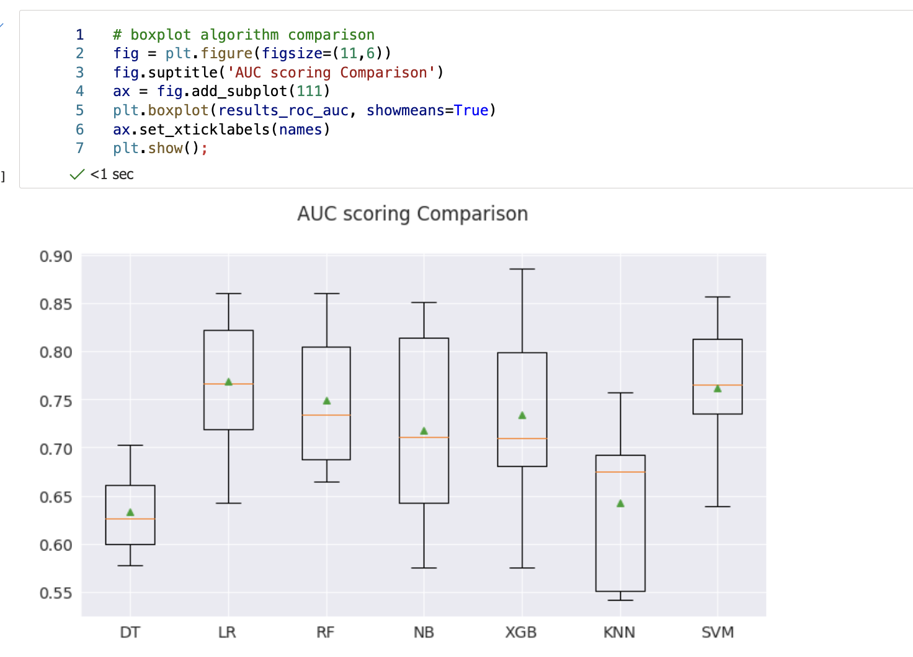

# Statistical analysis and ML comparison of prediction models

We have shown, that statistical analysis and all bolts and whistles can be done super simple in Azure machine learning. Today we will continue with feature engineering and modelling.

So, what is feature engineering? Is a general process and can involve both **feature construction**: adding new features from the existing data, and **feature selection**: choosing only the most important features for improving model performance, reducing data dimensionality, doing log-transformation, removing outliers, to do scaling (normalisation, standardisation), imputations, general transformation (and others, as polynomial), variable creation, variable extraction and so on.

One-hot encoding is another part of feature engineering, that we have seen in the previous post. and now, let’s create polynomial features of 2nd degree and train and transform the features.


```py
poly_features = df[['duration','account_bal_neg_bal','account_bal_no_acc']]
poly_target=df['target']
 
from sklearn.preprocessing import PolynomialFeatures
poly_transformer = PolynomialFeatures(degree = 2)
poly_transformer.fit(poly_features)
poly_features = poly_transformer.transform(poly_features)
poly_transformer.get_feature_names(input_features = ['duration','account_bal_neg_bal','account_bal_no_acc'])
 
# delete duplicates
for i in list(poly_features.columns):
  for j in list(df.columns):
    if (i==j):
      poly_features.drop(labels=i, axis=1, inplace=True)
 
poly_features.drop(labels='1', axis=1, inplace=True)
list(poly_features)
```

We have deleted the duplicated features and now we can calculate the correlations and make sure to remove any homoscedasticity and preferably also multicollinearity.

Once finished, we want to split the new dataset to train and test.

```py
from sklearn.model_selection import train_test_split
x, y = df.drop('target', axis=1), df['target']
x.shape, y.shape
 
x_train, x_test, y_train, y_test= train_test_split(x,y, test_size=.2, random_state=42)
x_train.shape, x_test.shape
```

And do normalisation and fitting.

```py
from sklearn.preprocessing import MinMaxScaler
scaler = MinMaxScaler(feature_range = (0, 1))
scaler.fit(x_train)
scaler.fit(x_test)
x_train= scaler.transform(x_train)
x_test= scaler.transform(x_test)
```

We can now start comparing the models. We will be using Recall and AUC as metrics for comparison between the models.


```py
import numpy as np
y.value_counts(normalize=True)
 
from sklearn.ensemble import RandomForestClassifier
from sklearn.linear_model import LogisticRegression
from sklearn.tree import DecisionTreeClassifier
from sklearn.neighbors import KNeighborsClassifier
from sklearn.ensemble import RandomForestClassifier
from sklearn.discriminant_analysis import LinearDiscriminantAnalysis
from sklearn.naive_bayes import GaussianNB
from sklearn.svm import SVC
from xgboost import XGBClassifier
from sklearn.metrics import roc_auc_score, recall_score, classification_report
from sklearn.model_selection import StratifiedKFold, cross_val_score, cross_validate
 
# model preps
models = []
models.append(('DT', DecisionTreeClassifier(random_state=42)))
models.append(('LR', LogisticRegression(random_state=42)))
models.append(('RF', RandomForestClassifier(random_state=42)))
models.append(('NB', GaussianNB())) 
models.append(('XGB', XGBClassifier(random_state=42)))
models.append(('KNN', KNeighborsClassifier())) 
models.append(('SVM', SVC(gamma='auto',random_state=42)))
 
 
# evaluate each model in turn
results_recall = []
results_roc_auc= []
names = []
recall= tp/ (tp+fn). Best value=1, worst value=0
scoring = ['recall', 'roc_auc']
 
for name, model in models:
        # split dataset into k folds. use one fold for validation and remaining k-1 folds for training
        skf= StratifiedKFold(n_splits=10, shuffle=True, random_state=42)
        cv_results = cross_validate(model, x_train, y_train, cv=skf, scoring=scoring)
        results_recall.append(cv_results['test_recall'])
        results_roc_auc.append(cv_results['test_roc_auc'])
        names.append(name)
 
        msg = "%s- recall:%f roc_auc:%f" % (name, cv_results['test_recall'].mean(),cv_results['test_roc_auc'].mean())
        print(msg)
```

And finally, we can do a comparison of each model performance, since, we stored everything in a data.frame.


Fig 1: Model comparison with AUC

