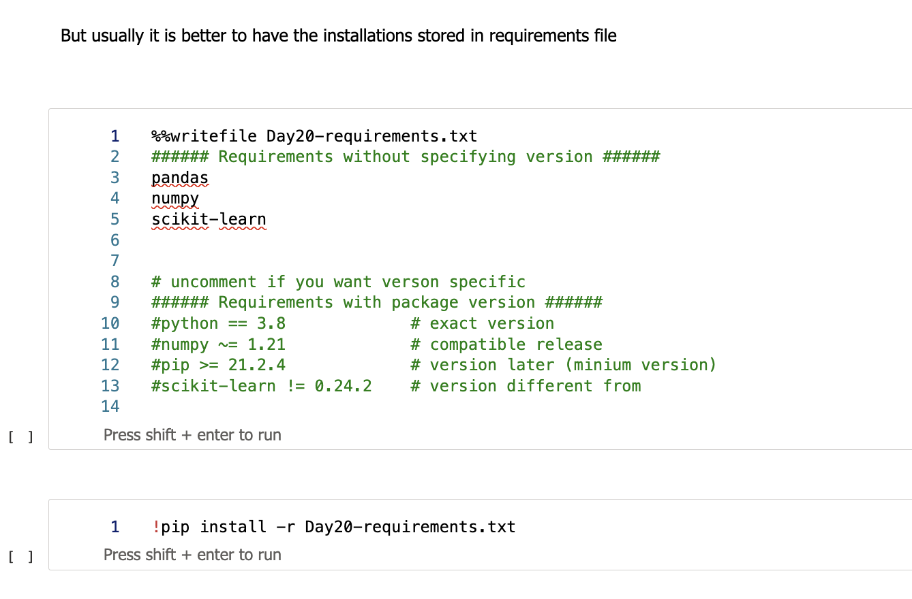
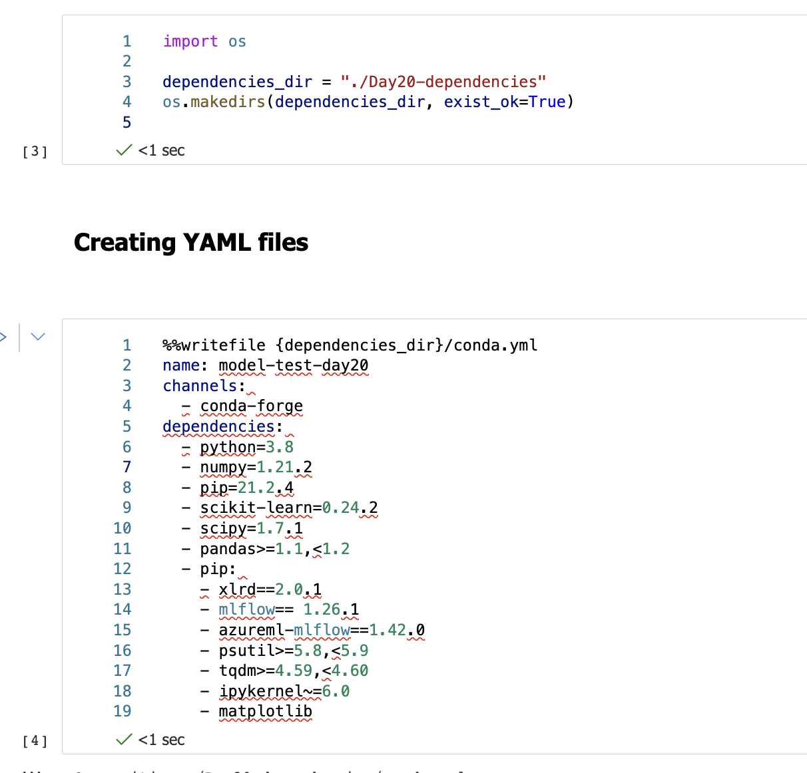

# Handling kernels, python packages, YAML files in notebooks and keeping structure and good practices

When creating notebooks, it is always a good way to have the dependencies included. Whether it is a particular version of a package, a separate script file or an installation requirement.

Selecting an environment or kernel can be an issue if it is not correctly initiated with the code. And you can also check the kernels with a simple python code:

```py
!jupyter kernelspec list
 
#or activate prefered kernel
!conda activate python38-azureml
#!jupyter kernelspec cmd install python38-azureml
```

Handling packages is another mandatory step to consider, especially if you are adding additional packages on top of the environment. Go check the installed packages or install a single one with:

```py
!pip list
 
#install separate package
!pip install pandas
```

The best way is to use a separate TXT file (requirements.txt) and specify the packages (with or without versions) for installation:

```py
!pip install -r Day20-requirements.txt
```

But creating a TXT file can always be added into notebooks, as a good practice and flawless installation.


Fig 1: Installing dependencies with TXT file

Python offers a great way to structure the code as well, simply using folders and naming conventions.

```py
import os
 
dependencies_dir = "./Day20-dependencies"
os.makedirs(dependencies_dir, exist_ok=True)
```

And you can always store YAML or TXT files here and keep your code traceable, reusable and structured.



Fig 2: Definition of a YAML file


Another way to have your code organised is to store it in smaller classes or functions for later reuse. Here is an example of a mlflow python file that will be stored separately and called each time, when training of the model will take place.

```py
%%writefile {train_src_dir}/main.py
import os
import argparse
import pandas as pd
import mlflow
import mlflow.sklearn
from sklearn.ensemble import GradientBoostingClassifier
from sklearn.metrics import classification_report
from sklearn.model_selection import train_test_split
 
def main():
    """Main function of the script."""
 
    # input and output arguments
    parser = argparse.ArgumentParser()
    parser.add_argument("--data", type=str, help="path to input data")
    parser.add_argument("--test_train_ratio", type=float, required=False, default=0.25)
    parser.add_argument("--n_estimators", required=False, default=100, type=int)
    parser.add_argument("--learning_rate", required=False, default=0.1, type=float)
    parser.add_argument("--registered_model_name", type=str, help="model name")
    args = parser.parse_args()
    
    # Start Logging
    mlflow.start_run()
 
    # enable autologging
    mlflow.sklearn.autolog()
 
    ###################
    #
    ###################
    print(" ".join(f"{k}={v}" for k, v in vars(args).items()))
 
    print("input data:", args.data)
     
    credit_df = pd.read_excel(args.data, header=1, index_col=0)
 
    mlflow.log_metric("num_samples", credit_df.shape[0])
    mlflow.log_metric("num_features", credit_df.shape[1] - 1)
 
    train_df, test_df = train_test_split(
        credit_df,
        test_size=args.test_train_ratio,
    )
    ####################
    ##################
    # Extracting the label column
    y_train = train_df.pop("default payment next month")
 
    # convert the dataframe values to array
    X_train = train_df.values
 
    # Extracting the label column
    y_test = test_df.pop("default payment next month")
 
    # convert the dataframe values to array
    X_test = test_df.values
 
    print(f"Training with data of shape {X_train.shape}")
 
    clf = GradientBoostingClassifier(
        n_estimators=args.n_estimators, learning_rate=args.learning_rate
    )
    clf.fit(X_train, y_train)
 
    y_pred = clf.predict(X_test)
 
    print(classification_report(y_test, y_pred))
    ###################
    ##########################
    # Registering the model to the workspace
    print("Registering the model via MLFlow")
    mlflow.sklearn.log_model(
        sk_model=clf,
        registered_model_name=args.registered_model_name,
        artifact_path=args.registered_model_name,
    )
 
    # Saving the model to a file
    mlflow.sklearn.save_model(
        sk_model=clf,
        path=os.path.join(args.registered_model_name, "trained_model"),
    )
    ###########################
    #
    ###########################
     
    # Stop Logging
    mlflow.end_run()
 
if __name__ == "__main__":
    main()
```

In addition, you can always store the sample data in files for testing purposes. Another good practice of keeping test data logged and stored (in this case as a JSON file).


```py
%%writefile {test_inference_dir}/sample-request.json
{
  "input_data": {
    "columns": [0,1,2,3,4,5,6,7,8,9,10,11,12,13,14,15,16,17,18,19,20],
    "index": [0, 1],
    "data": [
            [200,2,2,1,24,2,2,-1,-1,-2,-2,33,31,69,0,0,0,0,689,0,0],
            [10, 9, 8, 7, 6, 5, 4, 3, 2, 1, 10, 9, 8, 7, 6, 5, 4, 3, 2, 1, 10]
        ]
  }
}
```

