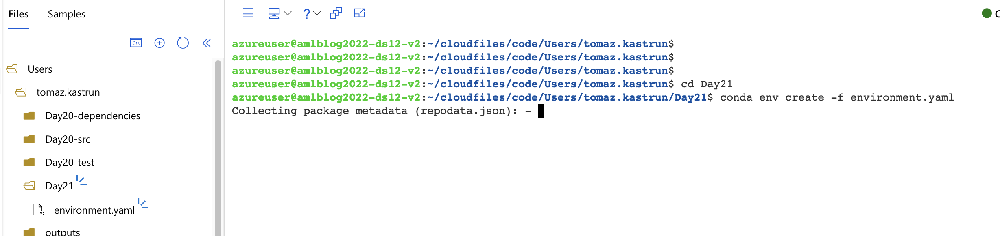
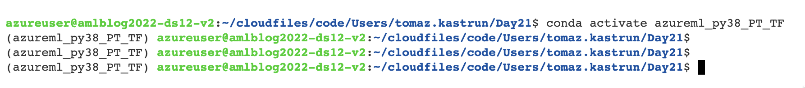
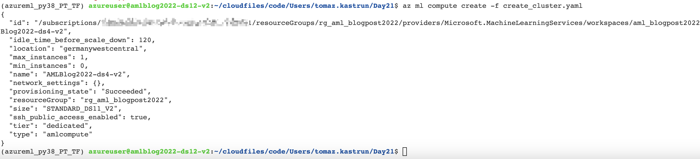
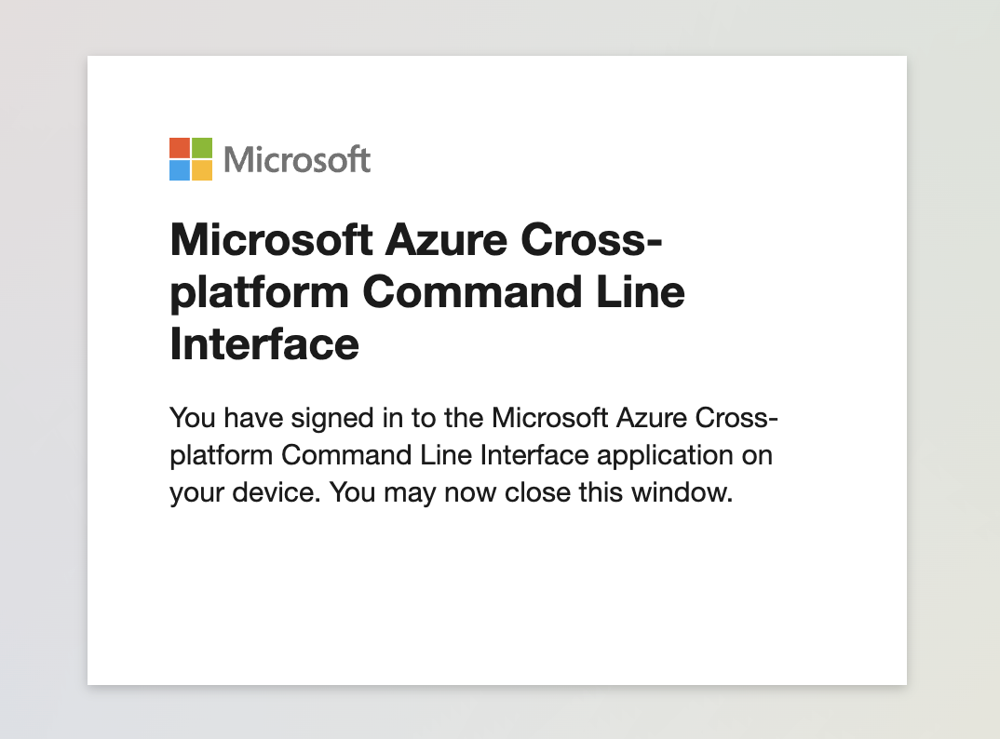

# Using Azure Machine Learning terminal

Using Azure CLI can help you progress faster, make repetitve tasks automated and even use the GIT integration, for faster and better collaboration.

So we have created a YAML file on Day20 and we can use it also with Azure CLI to create an environment.

```yml
name: aml_sweep
channels:
  - anaconda
  - conda-forge
dependencies:
  - python==3.10.4
  - mlflow==1.26.0
  - yapf==0.31.0
  - pylint==2.12.2
  - mypy==0.910
  - pip==21.2.3
  - pip:
    - types-tqdm==4.64.7.1
    - pandas-stubs==1.5.0.221012
```

And with opening terminal


Fig 1: Creating new conda environment using Azure CLI


With YAML file in place, simply just call your standard conda command:

```bash
conda env create -f environment.yaml
```

and simply call the environment with

```bash
conda activate env  /anaconda/envs/azureml_py38_PT_TF
```


Fig 2: Activating environment

Creating an computer instance is also an easy way to create using Azure CLI

```bash
az ml compute create -f create_cluster.yaml
```

YAML definition is (name of file is create_cluster.yaml):

```yml
$schema: https://azuremlschemas.azureedge.net/latest/amlCompute.schema.json
name: AMLBlog2022-ds4-v2
type: amlcompute
size: Standard_DS11_v2
min_instances: 0
max_instances: 1
```

and you will get a new compute cluster defined as:


Fig 3: JSON result of new compute created

prior to creating a compute, make sure to be logged in. You can always do this with az login.


Fig 4: create login with az login

With Azure CLI you can create any asset, from pipelines, datastores, datasets, deployment jobs, inference models, endpoints, and many many others.