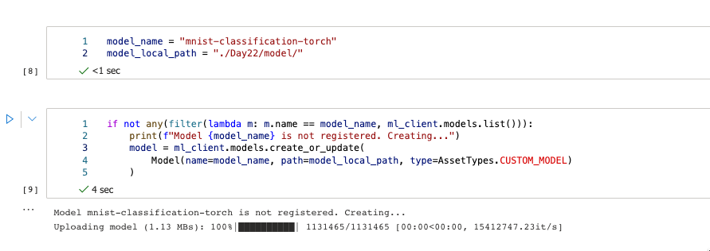

# Batch endpoints for batch scoring

Batch endpoints are a great and simple way to run inference over large volumes of data. They simplify the process of hosting your models for batch scoring.

We will import the needed Python libraries

```py
from azure.ai.ml import MLClient, Input
from azure.ai.ml.entities import (
    BatchEndpoint,
    BatchDeployment,
    Model,
    Environment,
    BatchRetrySettings,
    CodeConfiguration,
)
from azure.identity import DefaultAzureCredential
from azure.ai.ml.constants import AssetTypes, BatchDeploymentOutputAction
import random
import string
```

Once we have the packages covered, we have configured the workspace (for more details, follow notebook on GitHub) we need to


```py
#  Creating a unique endpoint name by including a random suffix
allowed_chars = string.ascii_lowercase + string.digits
endpoint_suffix = "".join(random.choice(allowed_chars) for x in range(5))
endpoint_name = "mnist-batch-" + endpoint_suffix
 
# endpoint configuration
endpoint = BatchEndpoint(
    name=endpoint_name,
    description="A batch endpoint for scoring images from the MNIST dataset.",
    tags={"type": "deep-learning"},
)
```

And following this, we will configure and create an endpoint.

```py
# configuration
import random
import string
 
# Creating a unique endpoint name by including a random suffix
allowed_chars = string.ascii_lowercase + string.digits
endpoint_suffix = "".join(random.choice(allowed_chars) for x in range(5))
endpoint_name = "mnist-batch-" + endpoint_suffix
 
# endpoint configuration
endpoint = BatchEndpoint(
    name=endpoint_name,
    description="A batch endpoint for scoring images from the MNIST dataset.",
    tags={"type": "deep-learning"},
)
 
# creation
ml_client.begin_create_or_update(endpoint).result()
```

Followed by the model registration. Make sure to check the data/Day22 folder to get the model files.

```py
model_name = "mnist-classification-torch"
model_local_path = "./Day22/model/"
 
if not any(filter(lambda m: m.name == model_name, ml_client.models.list())):
    print(f"Model {model_name} is not registered. Creating...")
    model = ml_client.models.create_or_update(
        Model(name=model_name, path=model_local_path, type=AssetTypes.CUSTOM_MODEL)
    )
 
#Let's get a reference to the model:
model = ml_client.models.get(name=model_name, label="latest")
```


Fig 1: Result of model registration

We also need to create a deployment and compute. The compute script is also known:

```py
from azure.ai.ml.entities import AmlCompute
 
compute_name = "cpu-cluster"
 
if not any(filter(lambda m: m.name == compute_name, ml_client.compute.list())):
    print(f"Compute {compute_name} is not created. Creating...")
    compute_cluster = AmlCompute(
        name=compute_name,
        description="CPU cluster compute",
        min_instances=0,
        max_instances=1,
    )
    ml_client.compute.begin_create_or_update(compute_cluster).result()
```

And we create compute and environment.

```py
from azure.ai.ml.entities import AmlCompute
 
compute_name = "cpu-cluster"
 
if not any(filter(lambda m: m.name == compute_name, ml_client.compute.list())):
    print(f"Compute {compute_name} is not created. Creating...")
    compute_cluster = AmlCompute(
        name=compute_name,
        description="CPU cluster compute",
        min_instances=0,
        max_instances=1,
    )
    ml_client.compute.begin_create_or_update(compute_cluster).result()
 
env = Environment(
    conda_file="./Day22/environment/conda.yaml",
    image="mcr.microsoft.com/azureml/openmpi3.1.2-ubuntu18.04:latest",
)
```

And finally, configure the deployment


```py
deployment = BatchDeployment(
    name="mnist-torch-dpl",
    description="A deployment using Torch to solve the MNIST classification dataset.",
    endpoint_name=endpoint_name,
    model=model,
    code_configuration=CodeConfiguration(
        code="./Day22/code/", scoring_script="batch_driver.py"
    ),
    environment=env,
    compute=compute_name,
    instance_count=2,
    max_concurrency_per_instance=2,
    mini_batch_size=10,
    output_action=BatchDeploymentOutputAction.APPEND_ROW,
    output_file_name="predictions.csv",
    retry_settings=BatchRetrySettings(max_retries=3, timeout=30),
    logging_level="info",
)
```

And create the deployment


Fig 2. Creation of deployment


For the last part, you need to invoke (start) the endpoint and the job.

```py
input = Input(
    type="uri_folder",
    path="https://pipelinedata.blob.core.windows.net/sampledata/mnist",
)
 
job = ml_client.batch_endpoints.invoke(
    endpoint_name=endpoint_name,
    input=input,
)
```
Once you infer on batch data and get the predictions on batch data, you can later do any type of analysis.
