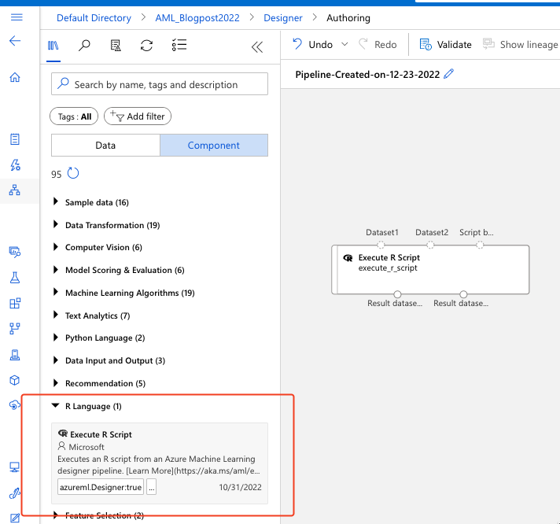
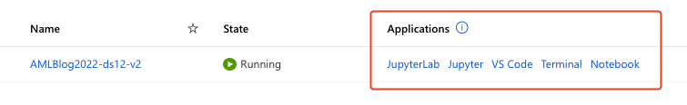
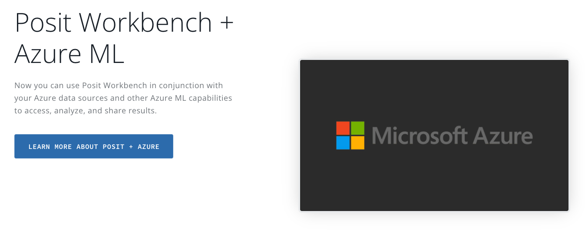
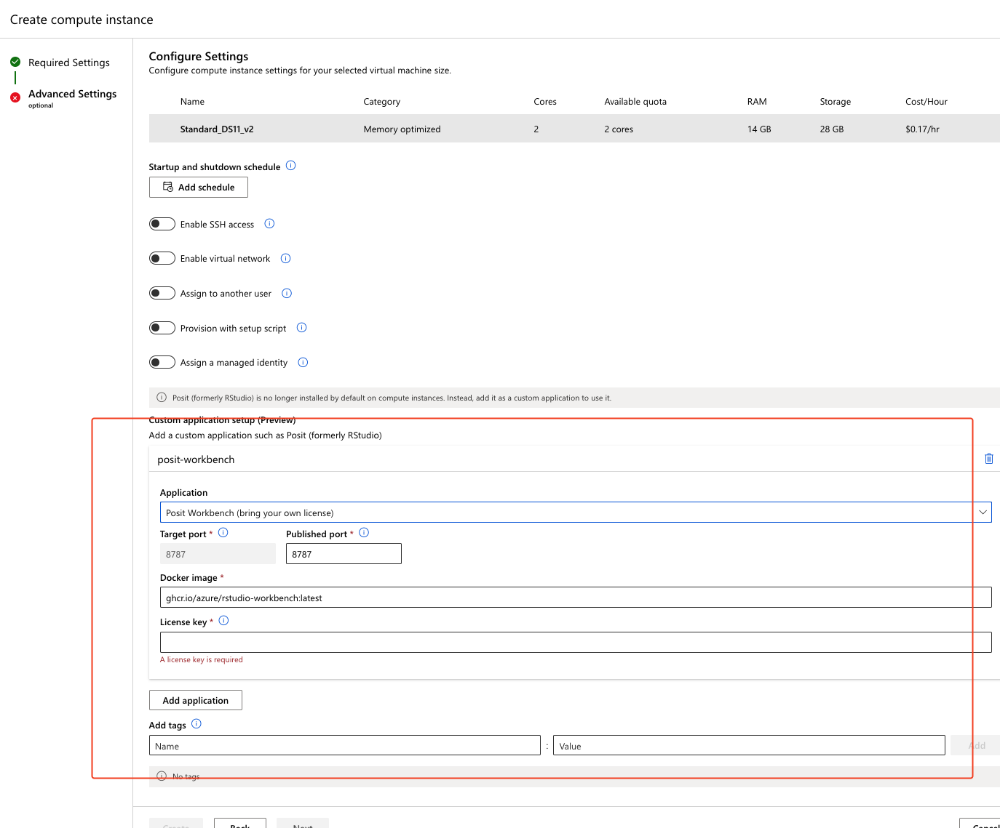

# Working with R

R language and Azure Machine Learning SDK for R was deprecated a year ago (end of 2021). But R can be still used for training and deployment by using Azure Machine learning CLI 2.0!

Furthermore, R language can be used in Machine Learning Designer, for data preparation, data wrangling and statistical analysis.

Fig 1.: Using R in Azure Machine Learning Designer

AzureML SKD for R can be found on this page: https://azure.github.io/azureml-sdk-for-r/index.html.

Another way to user R is to use Posit (RStudio) on your compute instance. When you will be creating a new compute instance and you will get to the application usages

Fig 2.: Applications available for compute instance

You can also install RStudio (Posit). But you will need a R Workbench license in order to install it.

On the Posit website, you can purchase the product

Fig 3.: Posit + Azure

And from there on, you need to add an additional application when configuring a compute instance.

Fig 4.: Installing R Workbench by Posit

You enter the license key and the Posit (Rstudio) will be available as an application and development environment for your disposal.

So, there are ways to use R in Azure ML, and you can always choose your preferred tool.

